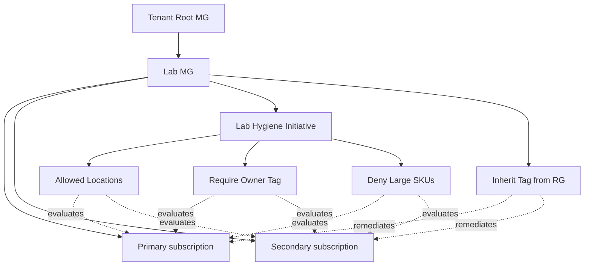

# Module 01 — Governance and cost

The governance layer of the **Secure Azure Administration Environment**. This module deploys a Lab management group containing two onboarded Azure subscriptions, assigns Azure Policy at MG scope (inheriting to both subscriptions), authors a custom policy denying VM SKUs above an approved baseline, applies resource group locks on shared services, demonstrates intentional policy denials end-to-end, and pins Cost Management dashboards keyed off the `Module` tag with cross-subscription roll-up.

> **Scope note:** This implementation runs on a single Azure subscription (Azure for Students). All multi-subscription references in this README — "two subscriptions," "across both subscriptions," "MG inheritance proof" — describe the **target architecture pattern**, not the deployed state. The MG hierarchy, policy assignments, and locks are real and operating; the cross-subscription proof is unavailable. See `docs/decisions/ADR-0005-single-subscription-scope.md` for the rationale and what specifically is not demonstrated.

By the end, the management-group scope rejects untagged or non-compliant deployments across both subscriptions, and per-module spend across both subscriptions is visible in a single pinned dashboard.

## What this module demonstrates

| Skill | Where it shows up |
|---|---|
| Management Group hierarchy | Lab MG deployed with both subscriptions onboarded |
| Cross-subscription policy inheritance | One initiative assignment at MG covers both subscriptions |
| Custom policy authoring | Custom JSON policy denying VM SKUs above DS2_v2 |
| Initiative composition | Tag, location, SKU policies grouped into one initiative |
| Compliance reporting | Pre/post compliance dashboard captures across both subs |
| Resource locks | CanNotDelete on platform RG with denied delete attempt |
| Cost Management at scale | Budgets per subscription, dashboard grouped by Module tag with MG-level rollup |
| Advisor literacy | All five Advisor categories captured and interpreted across both subscriptions |

## Build steps

This module uses **Azure CLI for resource group creation, MG creation, and policy assignment**, **JSON for custom policy definitions**, and **Portal for Cost Management and Advisor screenshots**.

### 1. Create the Lab management group and onboard both subscriptions

```bash
SUB_PRIMARY=$(az account list --query "[?name=='<primary-sub-name>'].id" -o tsv)
SUB_SECONDARY=$(az account list --query "[?name=='<secondary-sub-name>'].id" -o tsv)

# Create the Lab MG under the tenant root
az account management-group create --name lab-mg --display-name "Lab MG"

# Onboard both subscriptions
az account management-group subscription add --name lab-mg --subscription $SUB_PRIMARY
az account management-group subscription add --name lab-mg --subscription $SUB_SECONDARY

# Verify
az account management-group show --name lab-mg --expand --recurse -o jsonc
```

If the elevate-access toggle is required for tenant-root MG operations: Microsoft Entra → Properties → Access management for Azure resources → Yes (only as Global Administrator). Reference ADR-0003.

### 2. Create the nine resource groups in the primary subscription with tags applied at creation

```bash
az account set --subscription $SUB_PRIMARY
LOC=eastus
TAGS="Environment=lab Owner=$(whoami) CostCenter=portfolio ExpiryDate=$(date -d '+90 days' +%Y-%m-%d)"

for rg in network-hub platform identity compute storage monitor backup security iac hybrid; do
    az group create \
      --name "rg-${rg}-lab-${LOC}-01" \
      --location $LOC \
      --tags $TAGS Module="01-governance-cost"
done

az group list --query "[?tags.Environment=='lab'].[name,tags.Module]" -o table
```

### 3. Assign the built-in Allowed-Locations policy at MG scope

```bash
az policy assignment create \
  --name allowed-locations-eastus \
  --display-name "Lab — Allowed locations: eastus and eastus2" \
  --policy e56962a6-4747-49cd-b67b-bf8b01975c4c \
  --params '{"listOfAllowedLocations":{"value":["eastus","eastus2"]}}' \
  --scope "/providers/Microsoft.Management/managementGroups/lab-mg"
```

Verify denial in BOTH subscriptions:

```bash
# Primary
az account set --subscription $SUB_PRIMARY
az group create --name rg-test-westus --location westus
# Expect: RequestDisallowedByPolicy

# Secondary
az account set --subscription $SUB_SECONDARY
az group create --name rg-test-westus --location westus
# Expect: same denial
```

The denial in the secondary subscription proves MG-scope inheritance works.

### 4. Author and assign a custom policy denying large VM SKUs

`scripts/deny-large-sku.policy.json`:

```json
{
  "properties": {
    "displayName": "Lab — Deny VM SKUs above DS2_v2 baseline",
    "policyType": "Custom",
    "mode": "Indexed",
    "parameters": {
      "allowedSkus": {
        "type": "Array",
        "metadata": { "displayName": "Allowed VM SKUs" },
        "defaultValue": ["Standard_B1s", "Standard_B2s", "Standard_DS1_v2", "Standard_DS2_v2"]
      }
    },
    "policyRule": {
      "if": {
        "allOf": [
          { "field": "type", "equals": "Microsoft.Compute/virtualMachines" },
          { "not": { "field": "Microsoft.Compute/virtualMachines/sku.name", "in": "[parameters('allowedSkus')]" } }
        ]
      },
      "then": { "effect": "deny" }
    }
  }
}
```

Create at MG scope so both subscriptions inherit:

```bash
az policy definition create \
  --name deny-large-sku \
  --rules @scripts/deny-large-sku.policy.json \
  --management-group lab-mg

az policy assignment create \
  --name deny-large-sku-mg \
  --policy deny-large-sku \
  --scope "/providers/Microsoft.Management/managementGroups/lab-mg"
```

### 5. Build the Lab Hygiene Initiative

Group three policies (Allowed-Locations, Require-Tag-on-Resources for Owner tag, Deny-Large-SKUs) into one initiative. Assign at MG scope.

```bash
az policy set-definition create \
  --name lab-hygiene-initiative \
  --display-name "Lab Hygiene Initiative" \
  --management-group lab-mg \
  --definitions @scripts/initiative-lab-hygiene.json

az policy assignment create \
  --name lab-hygiene-mg \
  --policy-set-definition lab-hygiene-initiative \
  --scope "/providers/Microsoft.Management/managementGroups/lab-mg"
```

Wait one hour, then capture compliance dashboard.

### 6. Apply the lock on rg-platform

```bash
az lock create \
  --name protect-platform \
  --resource-group rg-platform-lab-eastus-01 \
  --lock-type CanNotDelete \
  --notes "Protects shared services — Log Analytics workspace, Sentinel, Automation Account"
```

Demonstrate by attempting delete:

```bash
az group delete --name rg-platform-lab-eastus-01 --yes
# Expect: ScopeLocked
```

### 7. Configure budgets on both subscriptions, then aggregate at MG view

Both subscription budgets configured in module 00. Now navigate to Cost Management → scope selector → Lab MG. Capture the cross-subscription cost view grouped by `Module` tag.

### 8. Apply tag inheritance via Modify policy

The built-in `Inherit a tag from the resource group` Modify policy. Assign at MG scope. Run remediation tasks for both subscriptions.

### 9. Open and pin Advisor for each subscription

Capture all five Advisor categories: Cost, Reliability, Security, Operational Excellence, Performance. The Cost view is most relevant in early modules; Security and Operational Excellence become richer after modules 06 and 08.

### 10. Demonstrate cross-subscription role assignment

Assign Reader at MG scope to a test user — they can now read across both subscriptions with one role assignment. Capture before (no access) and after (access on both).

## Validation

- `az account management-group show --name lab-mg --expand` returns both subscriptions.
- `az policy state list --management-group lab-mg` returns compliance entries from resources in both subscriptions.
- `az vm create --size Standard_E32s_v3` in either subscription returns `RequestDisallowedByPolicy`.
- `az group create --location westus` in either subscription returns `RequestDisallowedByPolicy`.
- The Lab Hygiene Initiative shows compliance percentages aggregated across both subscriptions.
- A Reader assigned at MG scope can list resource groups in both subscriptions.

## Cleanup

Resource groups, policy assignments, locks, and budgets are part of the sustained baseline. Nothing to tear down — they remain in force for every subsequent module.

**Cost:** $0 spent on this module. Sustained add: $0/month (policies, locks, MG hierarchy are free).

## Evidence

| File | Demonstrates |
|---|---|
| `screenshots/01-mg-hierarchy.png` | Lab MG with both subscriptions onboarded |
| `screenshots/01-mg-elevate-access.png` | Elevate-access toggle (if used) |
| `screenshots/01-rgs-tagged-primary.png` | Resource groups in primary subscription with all five required tags |
| `screenshots/01-policy-allowed-locations-mg.png` | Allowed-Locations policy at MG scope |
| `screenshots/01-policy-denial-westus-primary.png` | RequestDisallowedByPolicy in primary subscription |
| `screenshots/01-policy-denial-westus-secondary.png` | RequestDisallowedByPolicy in secondary subscription (MG inheritance proof) |
| `screenshots/01-policy-deny-large-sku.png` | Custom deny-large-SKU policy at MG scope |
| `screenshots/01-initiative-mg.png` | Lab Hygiene Initiative assigned at MG |
| `screenshots/01-initiative-compliance-aggregated.png` | Compliance % aggregated across both subscriptions |
| `screenshots/01-rg-lock.png` | CanNotDelete lock on rg-platform |
| `screenshots/01-lock-blocks-delete.png` | ScopeLocked error |
| `screenshots/01-tag-inherit-remediation.png` | Tag inheritance remediation completed |
| `screenshots/01-budgets-per-subscription.png` | Budgets visible per subscription |
| `screenshots/01-cost-mg-view.png` | Cost Management at MG scope showing both subscriptions |
| `screenshots/01-cost-by-module-tag.png` | Cost Analysis grouped by Module tag |
| `screenshots/01-advisor-five-categories.png` | All five Advisor categories |
| `screenshots/01-mg-reader-cross-sub.png` | Reader at MG scope reading across both subscriptions |
| `screenshots/01-mg-policy-exemption.png` | Policy exemption applied on a sandbox RG with documented waiver |
| `scripts/deny-large-sku.policy.json` | Custom policy definition |
| `scripts/initiative-lab-hygiene.json` | Initiative grouping all governance policies |
| `scripts/onboard-subscription.sh` | Script to onboard a new sub to Lab MG |
| `scripts/tag-coverage-report.sh` | Daily tag coverage report |
| `diagrams/01-mg-hierarchy.mmd` | MG → 2 subscriptions topology |
| `diagrams/01-policy-inheritance.mmd` | Policy assignment scope hierarchy |
| `diagrams/01-governance-overview.mmd` | Subscription → initiative → policies → resources |
| `docs/decisions/ADR-0002-tags-vs-rgs.md` | Decision: environment via tags |
| `docs/decisions/ADR-0003-mg-design.md` | Decision: MG hierarchy deployed |
| `docs/decisions/ADR-0004-deny-large-skus.md` | Decision: custom SKU deny policy |

### Mermaid diagram embedded — MG hierarchy and policy inheritance



## Resume bullets

- Deployed a management group hierarchy with two onboarded Azure subscriptions, demonstrating cross-subscription policy inheritance, role assignment delegation, and cost rollup at MG scope rather than per-subscription.
- Authored a custom Azure Policy denying virtual machine SKUs above an approved baseline, paired with built-in Allowed-Locations and tag-inheritance Modify policies, grouped into a management-group-scoped initiative inheriting to both subscriptions.
- Established compliance reporting via the Azure Policy compliance dashboard with cross-subscription aggregation, demonstrating policy effects with intentional denied deployments captured in both subscriptions as evidence.
- Implemented resource group locks (CanNotDelete) protecting shared platform services, validated by a denied delete attempt under role-restricted credentials.
- Configured Microsoft Cost Management with per-subscription budgets, three alert thresholds each, and an MG-scope dashboard aggregating spend across two subscriptions grouped by the `Module` tag.
- Reviewed Microsoft Advisor across all five categories (Cost, Reliability, Security, Operational Excellence, Performance) for both subscriptions and acted on the highest-impact recommendations.
- Demonstrated User Access Administrator scoped at management group covering two subscriptions with a single role assignment, contrasting against the per-subscription pattern.
- Applied a policy exemption (rather than just exclusion) on a sandbox resource group, demonstrating the modern waiver lifecycle pattern.

## Interview stories

### Beginner story — "How do you prevent surprise costs?"

Three layers. The first is a budget with three thresholds (50/80/100%) on every subscription before any resource is created. The second is a custom Azure Policy denying VM SKUs above an approved list — a single misconfigured deployment cannot exceed budget many times over because the deployment itself is rejected at the ARM API. The third is a daily orphan-resource audit that catches unattached disks, idle public IPs, and stranded NICs. This module has a screenshot of an attempted Standard_E32s_v3 deployment failing with `RequestDisallowedByPolicy` — that single denial demonstrates more than a hundred lines of compliant deployments.

### Intermediate story — "How do you handle multi-subscription governance?"

Most teams running multi-subscription start by duplicating policies per subscription. That doesn't scale and immediately drifts. The right pattern is management groups with policy assignments at MG scope; subscriptions inherit. This module demonstrates exactly that: one policy assignment at the Lab MG denies westus deployments in both subscriptions. The capture proof is the same denial error from both subscription contexts, generated in two consecutive `az` commands. The interviewer who asks this question is checking whether you've worked in real multi-account environments, because the answer reveals it.

### Architecture-level story — "How do you reason about policy effects?"

Three effect classes that matter: deny (rejects at ARM API time), audit (records non-compliance without blocking), and modify (mutates the request to add missing fields). The portfolio uses all three. Allowed-Locations is deny — the request fails. The custom audit-only policy on naming conventions records non-compliance without blocking, useful during migration windows when legacy resources have wrong names. Modify on tag inheritance silently fixes resources missing the Module tag. The deeper architectural point: policy is not a compliance tool, it is a deployment discipline tool. By the time you pass through the policy gate, the resource is shaped correctly. The architecture lesson is that effect choice carries operational consequence — deny too aggressively and you block legitimate work; audit only and you accumulate technical debt; modify silently and you confuse operators about what state the resource is in. The decision belongs in the ADR, not in the policy.

## Five-minute video script

See `videos/01-script.md`. Hook: *"In this video I'll deploy a custom Azure Policy that denies large VM SKUs at the management group scope, then show the same deployment fail in two different subscriptions to prove inheritance works."*
