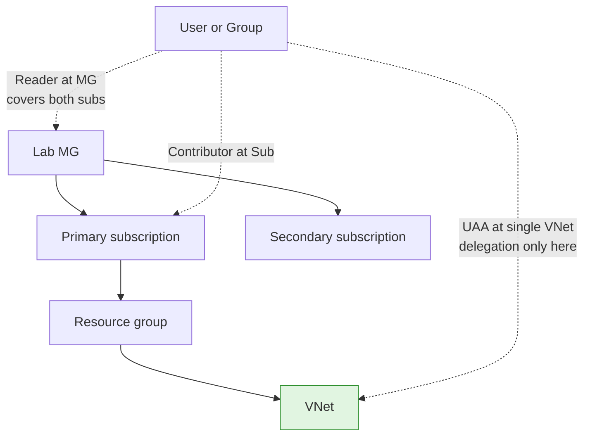

# Module 02 — Identity and RBAC

The identity layer of the **Secure Azure Administration Environment**. Users, groups, role assignments at the right scope, custom role definitions, Administrative Units, Conditional Access design and deployment **including report-only mode** as a deployment-safety pattern, and the discipline of least-privilege role selection across two subscriptions joined under the Lab management group.

The themes that recur in interviews — *Contributor cannot assign roles*, *bulk invitation creates guests not members*, *User Access Administrator scoped to a single resource* — are demonstrated end-to-end with both successful operations and intentional denials. The module also adds the modern Conditional Access **report-only** workflow: deploy a policy, observe what it would have done without enforcement, then promote to On.

## What this module demonstrates

| Skill | Where it shows up |
|---|---|
| User and group lifecycle | Bulk member create via Portal, bulk guest invitation via Microsoft Graph PowerShell |
| RBAC at the right scope | Role assignments at MG, sub, RG, and resource — with deliberate trade-offs |
| Custom role authoring | JSON-defined VNet Peering Manager role with multi-scope assignability |
| Administrative Units | Three AUs with scoped User Administrator delegation |
| Conditional Access design AND deployment | MFA from untrusted locations, hybrid-Entra-joined device requirement |
| Conditional Access report-only mode | Deploy in report-only, observe sign-in evaluation, promote to On |
| Hybrid identity literacy | Microsoft Entra Connect Sync architecture documented (deployed in module 11) |
| Privilege boundary thinking | Demonstrated denials when role lacks the permission |

## Build steps

This module uses **Microsoft Graph PowerShell for bulk operations**, **Azure CLI for RBAC**, and **Portal for Conditional Access, Administrative Units, and the report-only sign-in evaluation review**.

The legacy `AzureAD` and `MSOnline` PowerShell modules are end-of-life. Every script uses Microsoft Graph PowerShell.

### 1. Create test users (bulk-create wizard)

Microsoft Entra → Users → Bulk operations → Bulk create. Upload CSV with `Name`, `User name`, `Initial password`, `Block sign in`. Five test users `lab-user-01` through `lab-user-05`.

The bulk-create wizard creates **member** users — distinct from bulk invitation which creates guests.

### 2. Bulk invite guest users via Microsoft Graph PowerShell

`scripts/bulk-guest-invite.ps1`:

```powershell
Connect-MgGraph -Scopes "User.Invite.All"

$guests = Import-Csv -Path .\scripts\guests-template.csv
foreach ($g in $guests) {
    New-MgInvitation `
        -InvitedUserDisplayName $g.DisplayName `
        -InvitedUserEmailAddress $g.Email `
        -InviteRedirectUrl "https://myapps.microsoft.com" `
        -SendInvitationMessage:$true
    Write-Host "Invited $($g.Email)"
}
```

`New-MgInvitation` is the current cmdlet. The deprecated `New-AzureADMSInvitation` is not used. To distinguish: `New-MgUser` creates members; `New-MgInvitation` creates guests via redemption email.

### 3. Create groups

```bash
az ad group create --display-name "sg-vm-admins" --mail-nickname "sg-vm-admins"
az ad group create --display-name "sg-net-admins" --mail-nickname "sg-net-admins"
az ad group create --display-name "sg-readers" --mail-nickname "sg-readers"
```

Plus one M365 group via Portal (M365 groups support expiration policies; security groups do not).

### 4. Configure tenant-level M365 group expiration

Microsoft Entra → Groups → Expiration → 365 days. Documents the M365-vs-security distinction.

### 5. Create a dynamic membership group (P1 trial required)

Group with rule `(user.department -eq "Engineering")`. Demonstrates dynamic membership; membership updates automatically as user attributes change.

### 6. Demonstrate the role-assignment denial

Sign in as a user holding only `Contributor` on a resource group. Attempt `az role assignment create`. Capture the `AuthorizationFailed` error referencing the missing `Microsoft.Authorization/roleAssignments/write` permission.

Then sign in as yourself, grant **User Access Administrator** scoped to a single VNet (after module 03 creates VNets):

```bash
VNET_ID=$(az network vnet show -g rg-network-hub-lab-eastus-01 -n vnet-hub-lab-eastus-01 --query id -o tsv)
az role assignment create \
  --assignee-object-id $TEST_USER_ID \
  --assignee-principal-type User \
  --role "User Access Administrator" \
  --scope "$VNET_ID"
```

Re-test as the test user. Role assignment at VNet scope succeeds; the same operation at subscription scope still fails. UAA's permission is bounded by assignment scope.

### 7. Author a custom role

```json
{
  "Name": "VNet Peering Manager",
  "Description": "Can create, modify, and delete VNet peerings on the assigned VNets only.",
  "Actions": [
    "Microsoft.Network/virtualNetworks/peerings/read",
    "Microsoft.Network/virtualNetworks/peerings/write",
    "Microsoft.Network/virtualNetworks/peerings/delete",
    "Microsoft.Network/virtualNetworks/read",
    "Microsoft.Network/virtualNetworks/virtualNetworkPeerings/read"
  ],
  "AssignableScopes": [
    "/providers/Microsoft.Management/managementGroups/lab-mg"
  ]
}
```

Assignable at MG scope means it can be assigned at any sub or RG within the MG hierarchy.

### 8. Three Administrative Units

Office-NA, Office-EU, Office-APAC. Add test users. Assign User Administrator scoped to one AU. The AU-scoped admin can manage only users within that AU.

### 9. Conditional Access — design, deploy, and report-only mode

CA requires Microsoft Entra ID P1. Activate trial.

**First, design as markdown.** `docs/ca-policy-mfa-untrusted.md` documents the policy: Users (sg-admins), Conditions (Locations: Untrusted), Grant (MFA + Hybrid Microsoft Entra joined device), Session (8-hour SiF).

**Second, configure named locations.** Microsoft Entra → Security → Conditional Access → Named locations. Add home IP as Trusted, add a country IP range as Untrusted.

**Third, deploy the policy in report-only state.** Microsoft Entra → Security → Conditional Access → New policy → all settings as designed → State = **Report-only**. Save.

Sign in from an untrusted location (use a VPN or mobile hotspot). Wait 5 minutes for sign-in logs to populate. Microsoft Entra → Sign-in logs → filter to your sign-in → Conditional Access tab. The log shows what the report-only policy *would have* required. Capture this evaluation.

**Fourth, promote to On.** Edit the policy → State = **On**. Now the policy enforces.

Report-only is the modern deployment-safety pattern: catch policies that would block legitimate work *before* enforcement. The lesson is observability before enforcement.

### 10. Quick wins — directory roles, license blade, device settings, external collaboration, custom domain

Capture six identity-blade screenshots: directory role assignment (User Administrator), license assignment blade, device settings with additional local admin, external collaboration settings allowing User Admin to invite, custom domain TXT/MX verification.

## Validation

- `Get-MgUser -Filter "userType eq 'Member'"` returns the bulk-created members.
- `Get-MgUser -Filter "userType eq 'Guest'"` returns the bulk-invited guests.
- `az role assignment list --assignee $USER_ID --all -o table` shows UAA scoped to the VNet only.
- A test user with Contributor on an RG fails to assign a role; same user with UAA on a specific resource succeeds for that resource only.
- The Conditional Access policy in report-only mode shows up in sign-in log Conditional Access tab as "Report-only: Failure" or "Report-only: Success" without affecting the actual sign-in.
- After promoting to On, the same sign-in is now blocked or required to MFA.

## Cleanup

Test users, groups, custom role, AUs, and CA policies remain part of the sustained baseline (zero cost). If P1 trial was activated, **cancel within 30 days** to avoid conversion.

**Cost:** $0 spent on this module. Sustained add: $0/month.

## Evidence

| File | Demonstrates |
|---|---|
| `screenshots/02-bulk-create-members.png` | Five member users created via bulk-create wizard |
| `screenshots/02-guests-imported.png` | Guest users in directory after `New-MgInvitation` |
| `screenshots/02-bulk-delete-csv.png` | Bulk delete with UPN-only column |
| `screenshots/02-groups-created.png` | Three security groups in Microsoft Entra |
| `screenshots/02-m365-group-expiration-policy.png` | Tenant M365 group expiration at 365 days |
| `screenshots/02-dynamic-group-rule.png` | Dynamic membership group rule |
| `screenshots/02-contributor-cannot-assign.png` | AuthorizationFailed denial |
| `screenshots/02-uaa-scoped-to-vnet.png` | UAA role scoped to single VNet |
| `screenshots/02-uaa-grants-reader.png` | UAA user grants Reader on the VNet |
| `screenshots/02-uaa-cannot-assign-at-sub.png` | Same user denied at subscription scope |
| `screenshots/02-custom-role-applied.png` | VNet Peering Manager custom role |
| `screenshots/02-au-created.png` | Administrative Unit creation |
| `screenshots/02-au-scoped-role.png` | User Administrator scoped to AU |
| `screenshots/02-au-admin-limited-view.png` | AU-scoped admin sees only AU members |
| `screenshots/02-named-locations.png` | Named locations: home IP Trusted, country range Untrusted |
| `screenshots/02-ca-policy-report-only.png` | CA policy in Report-only state |
| `screenshots/02-ca-report-only-signin-evaluation.png` | Sign-in log Conditional Access tab showing report-only evaluation |
| `screenshots/02-ca-policy-on.png` | Same policy promoted to On |
| `screenshots/02-ca-grant-control.png` | Grant control requiring MFA and hybrid device |
| `screenshots/02-directory-role-user-admin.png` | Directory role assignment |
| `screenshots/02-license-assignment.png` | License assignment blade |
| `screenshots/02-device-settings-local-admin.png` | Device settings with additional local admin |
| `screenshots/02-external-collab-settings.png` | External collab allowing User Admin to invite |
| `screenshots/02-custom-domain-verify.png` | Custom domain TXT/MX verification records |
| `screenshots/02-signin-logs.png` | Sign-in logs filtered to recent activity |
| `screenshots/02-audit-logs.png` | Audit logs for directory operations |
| `screenshots/02-uadm-invites-success.png` | User Administrator successfully inviting after external-collab change |
| `screenshots/02-mg-reader-cross-sub.png` | Reader at MG scope demonstrated across both subs |
| `scripts/bulk-create-members-template.csv` | Bulk-create CSV template |
| `scripts/bulk-guest-invite.ps1` | Microsoft Graph PowerShell guest invitation |
| `scripts/custom-role-vnet-peering-manager.json` | Custom role definition |
| `diagrams/02-rbac-scopes.mmd` | Role assignment scope hierarchy |
| `diagrams/02-ca-policy-flow.mmd` | CA policy decision tree |
| `diagrams/02-ca-grant-vs-session.mmd` | Grant control vs session control |
| `diagrams/02-entra-connect-sync.mmd` | Hybrid identity sync (deployed in module 11) |
| `docs/ca-policy-mfa-untrusted.md` | CA policy design |
| `docs/decisions/ADR-0005-uaa-vs-owner.md` | UAA scoped narrowly over Owner |
| `docs/decisions/ADR-0022-ca-report-only.md` | Report-only mode as deployment-safety pattern |

### Mermaid diagram embedded — RBAC scope hierarchy



## Resume bullets

- Designed and deployed an identity layer for a multi-subscription Azure environment including security and Microsoft 365 groups, Administrative Unit-scoped delegation, custom RBAC roles assignable at management group scope, and Conditional Access policies enforcing multi-factor authentication and hybrid-Entra-joined device requirement for privileged access.
- Authored a custom Azure RBAC role (VNet Peering Manager) granting only the network peering operations required for a delegated team, applying least-privilege at resource scope rather than granting Owner or Contributor.
- Migrated all directory-management automation from the deprecated AzureAD and MSOnline PowerShell modules to Microsoft Graph PowerShell, replacing legacy cmdlets including `New-AzureADMSInvitation` with `New-MgInvitation` for bulk guest invitations.
- Demonstrated and documented that the Contributor role lacks role-assignment permission, building delegation patterns around User Access Administrator scoped to specific resources rather than broad Owner grants.
- Implemented the Conditional Access **report-only** deployment pattern: policy created in report-only state, sign-ins evaluated against it without enforcement, sign-in log evaluation captured, then promoted to On — the modern deployment-safety pattern that catches policies blocking legitimate work before enforcement.
- Implemented bulk user creation (Portal wizard, member users) and bulk guest invitation (Microsoft Graph PowerShell, `New-MgInvitation`), distinguishing the two operationally with redacted PII evidence.
- Configured Administrative Units segmenting delegated user-management for office-shaped scopes, with User Administrator scoped to a single AU demonstrating the limited admin view.
- Demonstrated cross-subscription Reader role assignment at management group scope — one role grant covers both subscriptions in the Lab MG, contrasting against per-subscription assignment patterns.
- Configured tenant-level Microsoft 365 group expiration at 365 days and documented the security-group-vs-M365-group lifecycle distinction.
- Operationalized identity-blade quick wins: directory role assignments, license assignment, device settings with additional local admin, external collaboration policy modification, and custom domain TXT/MX verification.

## Interview stories

### Beginner story — "How do you give someone permissions in Azure?"

The lazy answer is "make them Owner." The right answer is the role-assignment workflow: identify the smallest built-in role that covers the work, scope it to the smallest resource that satisfies the use case, assign through a security group rather than to an individual user, and document the assignment in an ADR if it crosses normal boundaries. This module captures three layered demonstrations: Reader at subscription, Contributor at resource group, and User Access Administrator at a single VNet. The capture proof is the failure case — Contributor attempts a role assignment and gets `AuthorizationFailed` because that permission belongs to UAA, Owner, or RBAC Administrator, not Contributor.

### Intermediate story — "How do you safely deploy a Conditional Access policy?"

The wrong answer is "create the policy and turn it On." That deploys an enforcement gate without measuring its effect first. The right answer is report-only mode: create the policy in report-only state, let real sign-ins evaluate against it, review the sign-in logs to see who would have been blocked or challenged, fix any over-broad scope or missed exclusions, then promote to On. The module captures all four steps end-to-end. The deeper point is the same as policy in module 01: enforcement gates need observability before they need teeth. Anyone who deploys CA policies in production without report-only first is one over-broad rule away from locking out their own break-glass account.

### Architecture-level story — "How do you reason about delegation in a multi-team environment?"

Two design tensions. First tension: bundled vs unbundled roles. Owner bundles operational permission and delegation permission; UAA unbundles them. The bundled answer is faster to grant; the unbundled answer is auditable per dimension. Second tension: scope. A role at MG scope is one assignment covering many subscriptions; a role at resource scope is many assignments but bounded blast radius. The portfolio's answer pattern is unbundled and narrowly scoped: a custom role for the operational work (VNet Peering Manager), plus UAA scoped to specific resources where the team needs to delegate. The architecture lesson is that least-privilege is a design discipline, not a constraint — it forces you to articulate exactly what each team does and what scope they need to do it. The custom role's `AssignableScopes` field is the architectural artifact; the role definition is operational. When a hiring manager reads the role-assignment patterns in this module, they're not just seeing RBAC competence — they're seeing organizational design.

## Five-minute video script

See `videos/02-script.md`. Hook: *"In this video I'll show why Contributor cannot assign roles in Azure, why that's actually the right design, and how User Access Administrator scoped narrowly is the modern delegation pattern."*
