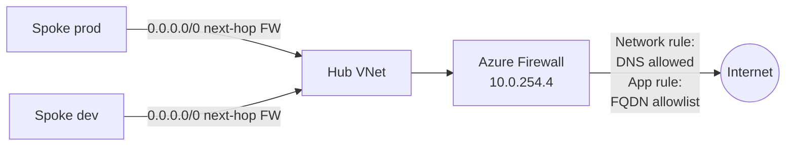

# Module 03 — Networking

The network fabric of the **Secure Azure Administration Environment**. The richest module in the portfolio. Hub-and-spoke topology with peering gateway-transit, NSGs at subnet scope, ASGs for role-based grouping, NSG rules using service tags, public and private DNS, internal Load Balancer, **Application Gateway WAF v2 deployed**, **Azure Firewall deployed**, **VPN Gateway deployed**, **Front Door deployed**, Network Watcher diagnostics, NSG flow logs feeding Traffic Analytics.

Every L4–L7 service the Azure administrator role surface tests is deployed end-to-end with capture evidence, then torn down via the kill-switch script.

## What this module demonstrates

| Skill | Where it shows up |
|---|---|
| Hub-and-spoke topology | Two spokes peered to one hub with gateway-transit flag pair |
| NSG fluency | Subnet-scoped NSGs, explicit deny rules, effective rules inspection |
| ASG modeling | Web/db ASGs allowing rule-by-role |
| Service tags | NSG rules referencing AzureKeyVault, AzureMonitor, Storage, AzureCloud, Internet |
| DNS | Public DNS zone with NS delegation, private DNS zone linked to VNet |
| Internal load balancing | Internal LB with TCP probe and Floating IP rule |
| **Application Gateway WAF v2** | Deployed in Prevention mode, captured blocking simulated attack |
| **Azure Firewall** | Deployed Standard, with network rules, application rules, NAT rules |
| **VPN Gateway** | Basic SKU deployed with one P2S configuration captured |
| **Front Door Standard** | One origin, one routing rule, request flow captured |
| Diagnostics | Network Watcher IP Flow Verify, Connection Troubleshoot, packet capture |
| Observability | NSG flow logs feeding Traffic Analytics |

## Build steps

This module uses **Azure CLI for VNets, peerings, NSGs, Firewall, AppGW, VPN GW, Front Door**, **Bicep for the reusable VNet module**, and **Portal for Network Watcher and Traffic Analytics**.

### 1. Create hub VNet with all reserved subnets

```bash
RG_NET=rg-network-hub-lab-eastus-01
LOC=eastus
TAGS="Environment=lab Owner=$(whoami) CostCenter=portfolio ExpiryDate=$(date -d '+90 days' +%Y-%m-%d) Module=03-networking"

az network vnet create -g $RG_NET -n vnet-hub-lab-eastus-01 \
  --address-prefixes 10.0.0.0/16 --location $LOC --tags $TAGS

# Reserved subnets
az network vnet subnet create -g $RG_NET --vnet-name vnet-hub-lab-eastus-01 -n snet-shared --address-prefixes 10.0.1.0/24
az network vnet subnet create -g $RG_NET --vnet-name vnet-hub-lab-eastus-01 -n AzureBastionSubnet --address-prefixes 10.0.250.0/26
az network vnet subnet create -g $RG_NET --vnet-name vnet-hub-lab-eastus-01 -n GatewaySubnet --address-prefixes 10.0.255.0/27
az network vnet subnet create -g $RG_NET --vnet-name vnet-hub-lab-eastus-01 -n AzureFirewallSubnet --address-prefixes 10.0.254.0/26
az network vnet subnet create -g $RG_NET --vnet-name vnet-hub-lab-eastus-01 -n snet-appgw --address-prefixes 10.0.253.0/27
```

### 2. Two spokes with peering using the flag pair

```bash
az network vnet create -g $RG_NET -n vnet-spoke-prod-lab-eastus-01 --address-prefixes 10.1.0.0/16 \
  --subnet-name snet-app --subnet-prefixes 10.1.1.0/24 --location $LOC --tags $TAGS

az network vnet create -g $RG_NET -n vnet-spoke-dev-lab-eastus-01 --address-prefixes 10.2.0.0/16 \
  --subnet-name snet-app --subnet-prefixes 10.2.1.0/24 --location $LOC --tags $TAGS

# Peering — both sides
az network vnet peering create -g $RG_NET -n hub-to-prod \
  --vnet-name vnet-hub-lab-eastus-01 --remote-vnet vnet-spoke-prod-lab-eastus-01 \
  --allow-vnet-access --allow-gateway-transit
az network vnet peering create -g $RG_NET -n prod-to-hub \
  --vnet-name vnet-spoke-prod-lab-eastus-01 --remote-vnet vnet-hub-lab-eastus-01 \
  --allow-vnet-access --use-remote-gateways

# Same for dev
```

### 3. NSGs, ASGs, service tags

NSG with allow-https rule, allow-web-to-db ASG-based rule, deny-all explicit, attached at subnet scope. ASGs `asg-web` and `asg-db` allow rule-by-role. Outbound rules to AzureKeyVault, AzureMonitor service tags. Outbound deny-all to Internet.

### 4. Internal Load Balancer build-and-tear-down

Standard ILB in spoke-prod with two B1s backend VMs running nginx. TCP probe + Floating IP load-balancing rule. curl validates round-robin. Tear down within 24 hours via kill-switch.

### 5. Public + private DNS

Public DNS zone with auto-assigned NS records demonstrates registrar-level delegation. Private DNS zone `privatelink.blob.core.windows.net` linked to spoke-prod, supports private endpoints in module 05.

### 6. Application Gateway WAF v2 — DEPLOYED

```bash
# Public IP for AppGW
az network public-ip create -g $RG_NET -n pip-agw-lab-eastus-01 --sku Standard --allocation-method Static

# AppGW with WAF v2 SKU
az network application-gateway create \
  -g $RG_NET -n agw-app-lab-eastus-01 \
  --location $LOC --capacity 2 --sku WAF_v2 \
  --vnet-name vnet-hub-lab-eastus-01 --subnet snet-appgw \
  --public-ip-address pip-agw-lab-eastus-01 \
  --servers 10.1.1.4 10.1.1.5 \
  --priority 100 \
  --waf-policy /subscriptions/<sub>/resourceGroups/$RG_NET/providers/Microsoft.Network/ApplicationGatewayWebApplicationFirewallPolicies/wafpolicy-app \
  --tags $TAGS

# Configure WAF policy in Prevention mode
az network application-gateway waf-policy create \
  -g $RG_NET -n wafpolicy-app \
  --type OWASP --version 3.2

az network application-gateway waf-policy update \
  -g $RG_NET -n wafpolicy-app \
  --state Enabled --mode Prevention
```

**Demonstrate WAF blocking.** From a workstation that can reach the AppGW public IP, run a request with a SQL-injection-pattern query string:

```bash
APPGW_IP=$(az network public-ip show -g $RG_NET -n pip-agw-lab-eastus-01 --query ipAddress -o tsv)
curl "http://$APPGW_IP/?id=1' OR '1'='1"
# Expect: 403 from WAF
```

Capture the WAF block in the AppGW logs (Diagnostic settings → AppGW → AzureDiagnostics table → KQL query):

```kusto
AzureDiagnostics
| where ResourceType == "APPLICATIONGATEWAYS"
| where Category == "ApplicationGatewayFirewallLog"
| where action_s == "Blocked"
| project TimeGenerated, ruleId_s, ruleSetType_s, requestUri_s, clientIp_s
```

**Tear down.** Via kill-switch script.

### 7. Azure Firewall — DEPLOYED

```bash
# Public IP for Firewall
az network public-ip create -g $RG_NET -n pip-fw-lab-eastus-01 --sku Standard --allocation-method Static

# Firewall Standard SKU
az network firewall create -g $RG_NET -n fw-hub-lab-eastus-01 \
  --location $LOC --sku AZFW_VNet --tier Standard --tags $TAGS

# IP configuration in AzureFirewallSubnet
az network firewall ip-config create \
  -g $RG_NET -f fw-hub-lab-eastus-01 -n fw-ipconfig \
  --public-ip-address pip-fw-lab-eastus-01 --vnet-name vnet-hub-lab-eastus-01

# Network rule — allow DNS from spoke to internet on 53
az network firewall network-rule create \
  -g $RG_NET -f fw-hub-lab-eastus-01 \
  -c rc-net-allow-dns -n allow-dns \
  --action Allow --priority 100 \
  --protocols UDP --source-addresses 10.1.0.0/16 \
  --destination-addresses '*' --destination-ports 53

# Application rule — allow contoso.com FQDN from spoke
az network firewall application-rule create \
  -g $RG_NET -f fw-hub-lab-eastus-01 \
  -c rc-app-allow-fqdn -n allow-contoso \
  --action Allow --priority 200 \
  --source-addresses 10.1.0.0/16 \
  --target-fqdns "*.contoso.com" \
  --protocols Http=80 Https=443
```

Capture network rule, application rule, NAT rule (optional). The Firewall demonstrates the modern centralized-egress pattern.

**Tear down within session — Firewall is the most expensive single resource at $1.25/hr.**

### 8. VPN Gateway Basic — DEPLOYED briefly

```bash
az network public-ip create -g $RG_NET -n pip-vng-lab-eastus-01 --sku Basic --allocation-method Dynamic

az network vnet-gateway create -g $RG_NET -n vng-hub-lab-eastus-01 \
  --public-ip-address pip-vng-lab-eastus-01 --vnet vnet-hub-lab-eastus-01 \
  --gateway-type Vpn --vpn-type RouteBased --sku Basic --no-wait

# Wait ~30 minutes for deployment
az network vnet-gateway show -g $RG_NET -n vng-hub-lab-eastus-01 --query provisioningState
```

Configure P2S address pool. Capture gateway deployed state and the gateway-transit flag working with the spokes. Tear down same day.

### 9. Front Door Standard — DEPLOYED

```bash
# Front Door profile and endpoint
az afd profile create -g $RG_NET --profile-name fd-portfolio-lab --sku Standard_AzureFrontDoor --tags $TAGS

az afd endpoint create -g $RG_NET --profile-name fd-portfolio-lab \
  --endpoint-name portfolio --enabled-state Enabled

# Origin group and origin pointing at the AppGW public IP from step 6
az afd origin-group create -g $RG_NET --profile-name fd-portfolio-lab \
  --origin-group-name og-app --probe-request-type GET --probe-protocol Http \
  --probe-interval-in-seconds 60 --probe-path / \
  --sample-size 4 --successful-samples-required 3

az afd origin create -g $RG_NET --profile-name fd-portfolio-lab \
  --origin-group-name og-app --origin-name origin-appgw \
  --host-name $APPGW_IP --priority 1 --weight 1000

# Routing rule
az afd route create -g $RG_NET --profile-name fd-portfolio-lab \
  --endpoint-name portfolio --route-name route-default \
  --origin-group og-app --supported-protocols Http Https \
  --link-to-default-domain Enabled --forwarding-protocol HttpOnly
```

Capture routing rule, origin health, request flow. Tear down within 72 hours.

### 10. Bastion Standard SKU — DEPLOYED briefly

```bash
az network public-ip create -g $RG_NET -n pip-bastion-lab-eastus-01 --sku Standard
az network bastion create -g $RG_NET -n bastion-hub-lab-eastus-01 \
  --public-ip-address pip-bastion-lab-eastus-01 --vnet-name vnet-hub-lab-eastus-01 \
  --location $LOC --sku Standard \
  --enable-tunneling true --enable-shareable-link true \
  --tags $TAGS
```

Connect to a VM through the browser and via native client (Standard SKU feature). Capture both. Tear down before logging off.

### 11. Network Watcher diagnostics + NSG flow logs + Traffic Analytics

Network Watcher IP Flow Verify (allow + deny), Connection Troubleshoot, packet capture (short). NSG flow logs to a storage account; Traffic Analytics to LA workspace. Capture geo-map of NSG flow data. Disable flow logs after evidence to control LA ingestion.

## Validation

- Both peering definitions show the flag pair (allowGatewayTransit on hub, useRemoteGateways on spoke).
- ILB front-end IP responds round-robin across two backends.
- AppGW WAF blocks the SQL-injection request with 403; the AzureDiagnostics log shows the OWASP rule that triggered.
- Firewall network and application rules show in `az network firewall show`.
- VPN Gateway provisioning state is Succeeded.
- Front Door endpoint resolves and routes to the AppGW origin.
- Network Watcher IP Flow Verify returns Allow / Deny appropriately.
- Traffic Analytics geo-map populates within 30 minutes of flow logs enabled.

## Cleanup

VNets, subnets, NSGs, ASGs, peerings, and DNS zones are sustained baseline. ILB, AppGW, Firewall, VPN GW, Front Door, Bastion, NSG flow logs, and the test backend VMs are torn down within their sessions via the kill-switch script.

The public DNS zone has a small monthly cost (~$0.50/zone/month) — delete after evidence if not revisiting.

```bash
# Run kill-switch from module 09
bash scripts/kill-switch.sh
```

**Cost:** ~$50–80 spent on this module across the deployment sessions (Firewall, AppGW, VPN GW, Front Door, ILB + backend VMs, Bastion). Sustained add: ~$0.50/month if public DNS retained.

## Evidence

| File | Demonstrates |
|---|---|
| `screenshots/03-vnet-hub-five-subnets.png` | Hub VNet with all five reserved subnet types |
| `screenshots/03-peering-hub-prod-flags.png` | Hub-side peering with allow-gateway-transit |
| `screenshots/03-peering-prod-hub-flags.png` | Spoke-side peering with use-remote-gateways |
| `screenshots/03-nsg-rules-table.png` | NSG with allow-https, allow-web-to-db, deny-all rules |
| `screenshots/03-nsg-service-tag-keyvault.png` | NSG rule with destination service tag AzureKeyVault |
| `screenshots/03-nsg-service-tag-azmon.png` | NSG rule with AzureMonitor service tag |
| `screenshots/03-asg-rule.png` | NSG rule using web and db ASGs |
| `screenshots/03-effective-rules.png` | Effective security rules on a NIC |
| `screenshots/03-public-dns-ns-records.png` | Public DNS zone with auto-assigned NS records |
| `screenshots/03-private-dns-zone-linked.png` | Private DNS zone linked to spoke-prod |
| `screenshots/03-ilb-front-end-config.png` | ILB front-end IP, backend pool, probe |
| `screenshots/03-ilb-load-balancing-rule.png` | LB rule with Floating IP |
| `screenshots/03-ilb-curl-roundrobin.png` | Curl alternating between backends |
| `screenshots/03-appgw-deployed.png` | AppGW WAF v2 deployed in Prevention mode |
| `screenshots/03-appgw-waf-policy.png` | WAF policy with OWASP 3.2 rule set |
| `screenshots/03-appgw-blocked-attack.png` | WAF returning 403 on SQL injection request |
| `screenshots/03-appgw-waf-log-kql.png` | KQL query showing WAF block in AzureDiagnostics |
| `screenshots/03-firewall-deployed.png` | Azure Firewall Standard deployed |
| `screenshots/03-firewall-network-rules.png` | Firewall network rule collection |
| `screenshots/03-firewall-application-rules.png` | Application rule collection with FQDN filtering |
| `screenshots/03-firewall-logs-kql.png` | Firewall logs in Log Analytics |
| `screenshots/03-vpn-gateway-deployed.png` | VPN Gateway in GatewaySubnet |
| `screenshots/03-vpn-gateway-p2s-config.png` | P2S configuration |
| `screenshots/03-front-door-profile.png` | Front Door Standard profile |
| `screenshots/03-front-door-routing.png` | Front Door routing rule |
| `screenshots/03-front-door-origin-health.png` | Origin health probe successful |
| `screenshots/03-bastion-standard-deployed.png` | Bastion Standard with shareable link enabled |
| `screenshots/03-bastion-session-browser.png` | Browser SSH session through Bastion |
| `screenshots/03-bastion-native-client.png` | Native-client connection (Standard SKU) |
| `screenshots/03-network-watcher-ip-flow-allow.png` | IP Flow Verify Allow result |
| `screenshots/03-network-watcher-ip-flow-deny.png` | IP Flow Verify Deny result |
| `screenshots/03-connection-troubleshoot.png` | Connection Troubleshoot end-to-end path test |
| `screenshots/03-packet-capture.png` | Packet capture session |
| `screenshots/03-nsg-flow-logs-enabled.png` | NSG flow logs configured |
| `screenshots/03-traffic-analytics-geomap.png` | Traffic Analytics geo-map |
| `screenshots/03-effective-routes.png` | Effective routes on a NIC |
| `screenshots/03-bastion-shareable-link.png` | Shareable link feature configured |
| `screenshots/03-appgw-listener.png` | AppGW listener configuration |
| `scripts/modules/vnet.bicep` | Reusable VNet Bicep module |
| `scripts/modules/nsg.bicep` | Reusable NSG Bicep module |
| `scripts/modules/firewall.bicep` | Reusable Firewall Bicep module |
| `scripts/modules/app-gateway.bicep` | Reusable AppGW Bicep module |
| `scripts/modules/front-door.bicep` | Reusable Front Door Bicep module |
| `scripts/queries/firewall-blocks.kql` | KQL for Firewall denials |
| `scripts/queries/waf-blocks.kql` | KQL for WAF blocks |
| `diagrams/03-hub-spoke-gateway-transit.mmd` | Topology with peering flags |
| `diagrams/03-firewall-egress.mmd` | Centralized egress through Firewall |
| `diagrams/03-appgw-waf-flow.mmd` | Request → WAF → backend |
| `diagrams/03-front-door-routing.mmd` | Front Door → AppGW origin |
| `diagrams/03-vpn-p2s.mmd` | P2S VPN topology |
| `diagrams/03-ilb-sql-listener.mmd` | ILB pattern fronting clustered backend |
| `diagrams/03-traffic-analytics.mmd` | NSG flow logs → storage → Traffic Analytics |
| `diagrams/03-network-watcher.mmd` | Network Watcher diagnostic flow |
| `docs/decisions/ADR-0006-hub-spoke.md` | Hub-and-spoke vs flat |
| `docs/decisions/ADR-0016-firewall-vs-nva.md` | Firewall in hub vs per-spoke NVAs |
| `docs/decisions/ADR-0017-appgw-vs-front-door.md` | AppGW WAF v2 vs Front Door selection |

### Mermaid diagram embedded — Firewall in hub centralized egress



## Resume bullets

- Designed and deployed a hub-and-spoke virtual network topology with bidirectional peering using `allow-gateway-transit` and `use-remote-gateways` flag pairs across two workload spokes.
- Implemented Network Security Groups at subnet scope with explicit deny-all rules, layered Application Security Groups for role-based traffic policy, and service-tag rules referencing AzureKeyVault, AzureMonitor, and Storage tag groups.
- Deployed and validated an internal Standard Load Balancer with TCP health probes and Floating IP load-balancing rules, demonstrating round-robin distribution across two nginx backends.
- Deployed Azure Application Gateway WAF v2 in Prevention mode with OWASP 3.2 rule set, captured the gateway blocking a simulated SQL injection request, and queried the AzureDiagnostics WAF logs to identify the triggered rule.
- Deployed Azure Firewall Standard with network rule collections, application rule collections including FQDN filtering, and centralized egress routing for spoke workloads.
- Deployed Azure VPN Gateway Basic SKU with point-to-site configuration validating the gateway-transit flag pair from peered spokes.
- Deployed Front Door Standard with origin group, origin health probes, and routing rules, demonstrating the global L7 acceleration and routing layer.
- Deployed Azure Bastion Standard SKU with shareable-link and native-client connection features, replacing public IPs on management interfaces.
- Operationalized network observability with Network Watcher diagnostics (IP Flow Verify, Connection Troubleshoot, packet capture) and NSG flow logs feeding Traffic Analytics.
- Authored Bicep modules for VNet, NSG, Firewall, Application Gateway, and Front Door resources, parameterized for reuse across environments.

## Interview stories

### Beginner story — "What is hub-and-spoke?"

A hub VNet holding shared services (Bastion, gateways, firewall) and one or more spoke VNets holding workloads. Spokes peer to the hub but not to each other. The peering uses two flags: `allow-gateway-transit` on the hub side and `use-remote-gateways` on the spoke side. Setting these wrong is the most common networking misconfiguration. The benefit is one set of shared services serving many workloads. The capture proof in this module shows both peering definitions side-by-side with the flag pair visible.

### Intermediate story — "When do you use Azure Firewall versus an NVA?"

Three trade-offs. Cost: Firewall Standard is $1.25/hour; an NVA is the cost of two VMs in HA plus the licensing. Operational complexity: Firewall is platform-managed, no patching; NVA is your responsibility for updates and HA. Feature breadth: Firewall does network rules, application rules with FQDN filtering, NAT, threat intelligence, and integrates with Azure Policy; NVAs may have specific features (deep packet inspection, custom VPN protocols) that Firewall doesn't. The portfolio chooses Firewall for the centralized-egress pattern because the operational simplicity beats the cost penalty for most Azure-native workloads. The decision is in ADR-0016 with the alternatives table. The architecture lesson: cost is not the only deciding factor, and operational simplicity pays back over years.

### Architecture-level story — "How do you design L7 protection for a multi-region application?"

The Azure answer is two layers. Front Door at the global edge for routing, TLS termination, and global WAF. Application Gateway WAF v2 at the regional edge for regional WAF, SSL offload, and backend health. Front Door selects the closest healthy region; AppGW handles the region-local traffic. Each WAF layer has its own rule set; Front Door's WAF runs first, AppGW's WAF runs second. The portfolio deploys both, both at lab scale and briefly. The KQL queries against the AzureDiagnostics tables for both services demonstrate the per-layer logging. The architecture lesson: defense in depth is layered tools with overlapping concerns, not redundant tools doing the same thing. The interviewer asking this question is checking whether you understand the layering, not just whether you know Azure has both services.

## Five-minute video script

See `videos/03-script.md`. Hook: *"In this video I'll deploy Azure Firewall, Application Gateway WAF v2, and Front Door in five minutes — and show how each one fits into a layered defense model."*
