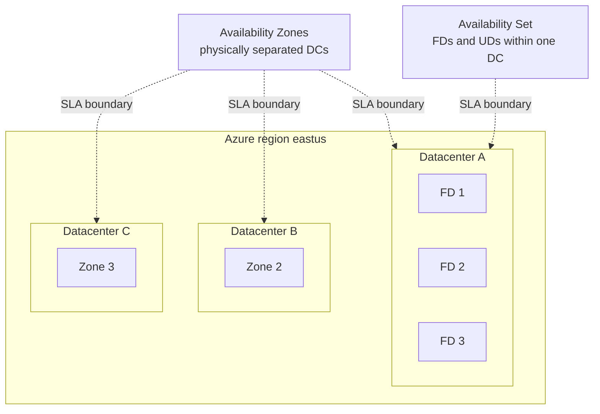

# Module 04 — Compute

The compute layer of the **Secure Azure Administration Environment**. VMs across Availability Sets and Availability Zones, VM Scale Sets with autoscale, managed disk lifecycle including detach-and-reattach without VM stop, snapshots, generalized images, VM extensions including Azure Monitor Agent, Just-in-Time VM access via Defender for Servers, Spot VMs for cost optimization, and Bastion Standard SKU features (shareable link, native client, IP-based connection).

## What this module demonstrates

| Skill | Where it shows up |
|---|---|
| VM provisioning | Single VMs, AvSet (FD=3, UD=20 with intentional FD=10 failure), Availability Zones, Spot tier |
| Disk operations | Detach-attach across VMs without stopping, snapshots, managed image generation |
| Bootstrapping | cloud-init for Linux, Custom Script Extension, Run Command |
| VMSS autoscale | Stress test triggers scale-out, validated end-to-end |
| Bastion Standard | Shareable link, native-client connection, browser session |
| JIT VM access | Defender for Servers Plan 2 enables JIT, time-bounded NSG rules |
| VM extensions | Azure Monitor Agent (modern), Custom Script, Run Command, JIT |
| Cost tier choices | Spot with max-price, Reserved Instance design, Hybrid Benefit awareness |
| Image lifecycle | Generalized VM → managed image, VM Image Builder modern alternative |

## Build steps

Azure CLI for provisioning, cloud-init for Linux bootstrap, Bicep for the AvSet template, Portal for JIT and VMSS autoscale screenshots.

### Steps summary

1. **AvSet at FD=3, UD=20 + intentional FD=10 failure capture** — `az vm availability-set create`
2. **VM in Availability Zone 1** — contrasts AvSet single-DC HA with Zone cross-DC HA
3. **cloud-init CA trust on Linux VM** — first-boot CA install
4. **Disk detach/attach across VMs without stopping** — `umount`, `az vm disk detach`, `az vm disk attach`, mount on second VM. Both VMs running throughout.
5. **Disk snapshot** — `az snapshot create`
6. **Generalize VM → managed image** — `waagent -deprovision+user`, `az vm deallocate`, `az vm generalize`, `az image create`
7. **VMSS with autoscale** — stress test triggers scale-out from 2 to 4 instances
8. **Bastion Standard SKU** — shareable link enabled, native-client connection captured
9. **JIT VM access via Defender for Servers Plan 2** — request, temporary NSG rule, timeout
10. **Spot VM with `--max-price 0.005 --eviction-policy Deallocate`**
11. **VM extensions** — AMA installed, Custom Script Extension installs nginx, Run Command executes script
12. **VM move between RGs** — `az resource move` with all dependent resources

## Validation

- AvSet shows FD=3, UD=20.
- FD=10 attempt returns `InvalidParameter`.
- Disk move: both VMs in Running state during operation.
- VMSS scales from 2 to 4 instances on CPU > 70%.
- JIT request opens NSG rule for 3 hours, then automatically removes it.
- Bastion shareable link works from outside the tenant.
- Native client (`az network bastion ssh`) connects to the VM.

## Cleanup

VMs, VMSS, Spot VMs are torn down end of session. Bastion via kill-switch script. Defender for Servers Plan 2 reverted to Free after JIT evidence.

**Cost:** ~$5–10 spent. Sustained add: <$1/month if image retained.

## Evidence

| File | Demonstrates |
|---|---|
| `screenshots/04-avset-fd3-ud20.png` | Availability Set with FD=3, UD=20 |
| `screenshots/04-avset-fd10-error.png` | Validation error on FD=10 |
| `screenshots/04-avset-resize-error.png` | Resize blocked when other AvSet members running |
| `screenshots/04-vm-zoned.png` | VM in Availability Zone 1 |
| `screenshots/04-vm-trusted-ca-verified.png` | cloud-init CA trust validated |
| `screenshots/04-disk-detach-attach-success.png` | Disk move with no VM stop |
| `screenshots/04-disk-snapshot.png` | Managed disk snapshot |
| `screenshots/04-image-created.png` | Managed image visible |
| `screenshots/04-vmss-deployed.png` | VMSS with two initial instances |
| `screenshots/04-vmss-scaled-out.png` | VMSS scaled to four instances after stress test |
| `screenshots/04-jit-config.png` | JIT VM access policy |
| `screenshots/04-jit-request-allowed.png` | JIT request approved with temp NSG rule |
| `screenshots/04-jit-rule-expired.png` | NSG rule absent after timeout |
| `screenshots/04-bastion-shareable-link.png` | Bastion shareable link generated |
| `screenshots/04-bastion-native-client.png` | Native client connection from terminal |
| `screenshots/04-spot-vm-config.png` | Spot VM with max-price |
| `screenshots/04-run-command.png` | Run Command output |
| `screenshots/04-custom-script-extension.png` | Custom Script Extension result |
| `screenshots/04-vm-resource-move.png` | VM moved to different RG |
| `screenshots/04-ama-installed.png` | Azure Monitor Agent extension installed |
| `screenshots/04-vm-insights.png` | VM Insights view |
| `screenshots/04-effective-routes.png` | Effective routes on a NIC |
| `scripts/cloud-init-ca-trust.yaml` | cloud-init for first-boot CA trust |
| `scripts/avset.bicep` | AvSet Bicep |
| `scripts/mount-data-disk.sh` | Disk mount automation |
| `scripts/vm-image-builder-design.bicep` | Modern image pipeline design |
| `diagrams/04-avset-vs-zones.mmd` | AvSet single-DC vs Zones cross-DC |
| `diagrams/04-vm-extension-stack.mmd` | AMA, Custom Script, Run Command, JIT |
| `diagrams/04-bastion-standard.mmd` | Bastion Standard with shareable link and native client |
| `docs/decisions/ADR-0007-avset-vs-zones.md` | Zones for new workloads |

### Mermaid diagram embedded — AvSet vs Zones

## Resume bullets

- Operationalized Azure VM workloads across Availability Sets (FD=3, UD=20) and Availability Zones, with documented decision favoring Zones for new workloads.
- Managed disk lifecycle including detach-and-reattach across VMs without stopping either machine, snapshot creation, and managed image generation from generalized VMs.
- Built and validated a Virtual Machine Scale Set with CPU-based autoscale, demonstrated end-to-end with stress test producing observable scale-out and scale-in.
- Implemented Just-in-Time VM access through Microsoft Defender for Servers Plan 2, replacing always-open management ports with time-bounded approval-gated NSG rules.
- Deployed Azure Bastion Standard SKU with shareable-link and native-client connection features.
- Delivered VM bootstrapping via cloud-init for Linux, Custom Script Extension, and Run Command for ad-hoc operations.
- Deployed Spot VMs with max-price configuration and eviction-policy Deallocate, demonstrating cost-optimized batch workload patterns.
- Migrated VM monitoring from the deprecated Log Analytics agent to Azure Monitor Agent with Data Collection Rules.

## Interview stories

### Beginner — "Why move a managed disk between VMs without stopping them?"

Moving a managed disk between VMs in Azure is a metadata operation at the platform level. Stopping or deallocating the source VM is unnecessary; only `umount` inside the source OS is required. Avoiding unnecessary downtime is what platform engineering looks like in practice — the lazy answer applies a stop the platform doesn't need.

### Intermediate — "AvSet or Zones?"

AvSet protects against rack and update-domain failures within a single datacenter (99.95% SLA). Zones protect against datacenter-level failures across physically separated datacenters in the same region (99.99% SLA). Modern designs default to Zones for new workloads. Existing AvSet-based workloads stay on AvSet for continuity. Zone-redundant SKUs cost ~10% more; cross-zone traffic incurs minor data transfer.

### Architecture — "How do you design VM access patterns at scale?"

Three layers. Identity layer: every VM has system-assigned Managed Identity (module 08); humans never use VM credentials directly. Network layer: every management interface goes through Bastion (Standard SKU for shareable links); no public IPs on management ports. Just-in-time layer: even Bastion access is gated by JIT requests when Defender for Servers is enabled; access is approved per-request, time-bounded, source-IP-bounded. The architecture is layered so a compromise of any one layer doesn't grant standalone access.

## Five-minute video script

See `videos/04-script.md`. Hook: *"In this video I'll move a managed disk from one VM to another without stopping either machine — and show why the platform doesn't need the stop the lazy answer assumes."*
