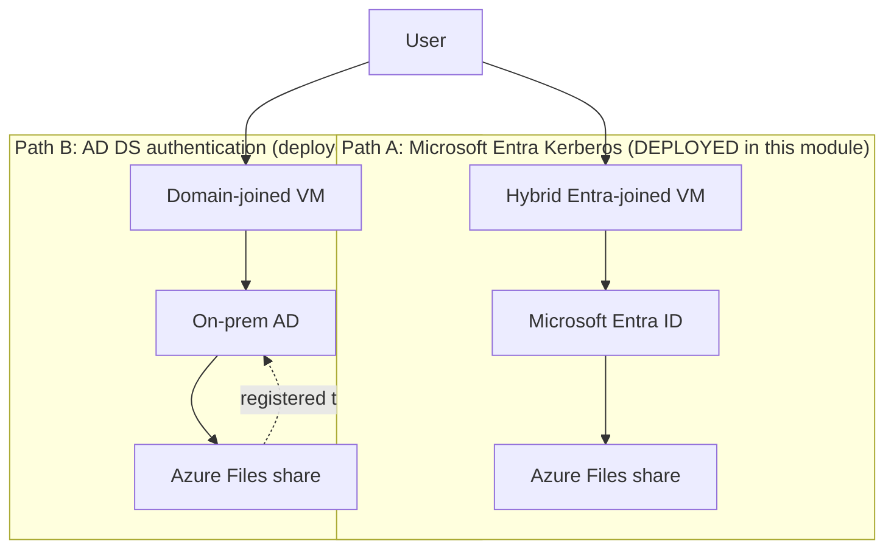

# Module 05 — Storage

The data layer of the **Secure Azure Administration Environment**. Hardened-on-creation storage account, private endpoint with private DNS integration, blob versioning + soft delete + lifecycle + immutability, AzCopy with user-delegation SAS, and **Azure Files with Microsoft Entra Kerberos authentication actually configured** (not design-only).

## What this module demonstrates

| Skill | Where it shows up |
|---|---|
| Storage account hardening on creation | TLS 1.2, HTTPS-only, public access disabled, shared keys disabled |
| Network controls | Storage firewall, private endpoint with private DNS |
| Data protection | Versioning, soft delete, immutability, lifecycle tier transitions |
| Authentication models | User-delegation SAS, RBAC roles, no shared keys |
| Cost optimization | Lifecycle hot → cool (30d) → archive (90d) → delete (365d) |
| **Files Microsoft Entra Kerberos** | Hybrid Entra-joined VM mounting share with Entra credentials |
| Cost export | Daily Cost Management export to managed container |

## Build steps

Azure CLI for storage account configuration, Bicep for the storage module, AzCopy for benchmarks, Portal for private endpoint and Files Entra Kerberos.

### Steps summary

1. **Hardened storage account on creation** — TLS 1.2 min, HTTPS only, public-access disabled, public-blob disabled, shared-key disabled, LRS GPv2
2. **Storage Blob Data Contributor self-grant** — required because shared keys are disabled
3. **Private endpoint for blob sub-resource** — wired to private DNS zone
4. **Validate FQDN resolves to private IP from VNet VM**
5. **Blob container with versioning + soft delete + lifecycle policy** — JSON policy file
6. **Container immutability policy** — time-bounded write-once-read-many
7. **AzCopy upload with user-delegation SAS** — `--auth-mode login --as-user`
8. **Azure Files share** — 50 GB quota
9. **Microsoft Entra Kerberos for Files (DEPLOYED)** — Storage account → Identity → Configure → Microsoft Entra Kerberos → enable. Configure share-level RBAC role (Storage File Data SMB Share Reader/Contributor/Elevated Contributor). Hybrid Entra-joined VM mounts the share with Entra credentials, no domain join required.
10. **Cost Management export** — daily export to managed container
11. **Storage diagnostic settings** — Read/Write/Delete + AllMetrics to LA workspace

## Validation

- `az storage account show` returns hardening settings.
- `nslookup` from inside VNet resolves to 10.x.x.x private IP.
- AzCopy without `--auth-mode login` fails (shared keys disabled); with login succeeds.
- Lifecycle policy visible in Lifecycle management.
- Immutability policy blocks blob delete within retention period.
- Hybrid Entra-joined VM mounts Azure Files share with Entra Kerberos and reads files.

## Cleanup

Storage account is sustained baseline. Private endpoint deleted after evidence (~$7/month if retained).

**Cost:** <$2 spent. Sustained add: ~$1/month for storage.

## Evidence

| File | Demonstrates |
|---|---|
| `screenshots/05-storage-account-hardened.png` | Six hardening settings |
| `screenshots/05-storage-firewall.png` | Public access disabled |
| `screenshots/05-private-endpoint.png` | Private endpoint visible |
| `screenshots/05-pe-nslookup.png` | Private IP resolution |
| `screenshots/05-storage-rbac-role.png` | Storage Blob Data Contributor assigned |
| `screenshots/05-shared-key-denied.png` | Auth error without --auth-mode login |
| `screenshots/05-versioning-enabled.png` | Versioning toggle on |
| `screenshots/05-soft-delete-enabled.png` | Blob and container soft delete |
| `screenshots/05-lifecycle-policy.png` | Lifecycle tier transitions |
| `screenshots/05-immutable-policy.png` | Immutability policy |
| `screenshots/05-immutable-blocks-delete.png` | Delete rejected by immutability |
| `screenshots/05-azcopy-upload.png` | AzCopy upload with user-delegation SAS |
| `screenshots/05-files-share.png` | Azure Files share |
| `screenshots/05-files-entra-kerberos-enabled.png` | Microsoft Entra Kerberos enabled on storage account |
| `screenshots/05-files-share-rbac-role.png` | Storage File Data SMB Share Contributor assigned |
| `screenshots/05-files-mounted-entra-kerberos.png` | Hybrid Entra-joined VM mounting share with Entra credentials |
| `scripts/modules/storage.bicep` | Reusable storage Bicep |
| `scripts/lifecycle-policy.json` | Lifecycle JSON |
| `diagrams/05-azure-files-identity-auth.mmd` | AD DS and Entra Kerberos paths |
| `diagrams/05-storage-network-topology.mmd` | Storage behind PE with private DNS |
| `diagrams/05-cmk-flow.mmd` | CMK with KV-stored key (configured in module 08) |
| `docs/redundancy-cheatsheet.md` | LRS/ZRS/GRS/GZRS/RA-GZRS decision matrix |
| `docs/auth-decision.md` | SAS vs RBAC vs access keys |
| `docs/decisions/ADR-0008-disable-shared-keys.md` | Disable shared key access |

### Mermaid embedded — Files identity authentication paths

## Resume bullets

- Hardened an Azure Storage account on creation with TLS 1.2 minimum, HTTPS-only enforcement, public network access disabled, public blob access disabled, and shared key access disabled — forcing all data-plane operations through Microsoft Entra ID-authenticated RBAC.
- Implemented private endpoint connectivity with private DNS zone integration, validated by FQDN resolution to private IPs from inside the workload VNet.
- Configured layered blob data protection: account-level versioning, blob and container soft delete with 7-day retention, lifecycle tier transitions (hot → cool 30d → archive 90d → delete 365d), and time-bounded immutability policy on a compliance container.
- Deployed Azure Files with Microsoft Entra Kerberos authentication, enabling hybrid Entra-joined VMs to mount file shares using cloud-only credentials without on-premises Active Directory dependency.
- Operationalized cost visibility with daily Cost Management exports to a managed container and storage diagnostic settings feeding the centralized Log Analytics workspace.
- Authored a reusable storage Bicep module producing hardened-by-default storage accounts.
- Documented and demonstrated dual identity-based authentication paths for Azure Files: on-premises AD DS authentication for domain-joined VMs (module 11) and Microsoft Entra Kerberos for hybrid-Entra-joined cloud-only environments (this module).

## Interview stories

### Beginner — "Why disable shared keys on storage accounts?"

Shared keys are full-access credentials with no per-identity attribution. Compromise requires full key rotation. Disabling shared key access forces every operation through Microsoft Entra ID with RBAC, where access is attributable, revocable per-identity, and audited per-identity. Strong defaults beat strong policies — a configuration that physically cannot leak shared keys is more reliable than a rotation schedule that depends on someone remembering.

### Intermediate — "When do you use Entra Kerberos versus AD DS for Azure Files?"

Entra Kerberos is for cloud-only environments — VMs are hybrid Entra-joined, no on-premises AD required, share access via Entra credentials. AD DS authentication is for hybrid environments where domain-joined VMs already authenticate to on-premises AD; the storage account is registered with the domain and shares respect AD permissions. The portfolio deploys both paths: Entra Kerberos in this module, AD DS in module 11 against the local Windows Server. The decision rule is "match the existing identity infrastructure" — adding AD DS just for Azure Files is unnecessary; adding Entra Kerberos when AD DS already exists creates a parallel auth path that's harder to manage.

### Architecture — "How do you reason about storage encryption at scale?"

Layered. Microsoft-managed keys (default) for low-risk data — encryption is platform responsibility. Customer-managed keys (CMK) backed by Key Vault for regulated data where the encryption key custody itself is the compliance requirement. Customer-provided keys (CPK) for the rare case where the customer needs the key never to touch Azure infrastructure — out of scope for most workloads. The portfolio uses CMK for the storage account encryption (configured in module 08) with automatic key rotation enabled. The deeper architectural point is that key custody is the compliance dimension, not the encryption itself — every storage account is encrypted, but only some require the customer to hold the key.

## Five-minute video script

See `videos/05-script.md`. Hook: *"In this video I'll show how Microsoft Entra Kerberos lets a cloud-only VM mount an Azure Files share with no on-prem AD — and why this is the modern path for hybrid identity workloads."*
