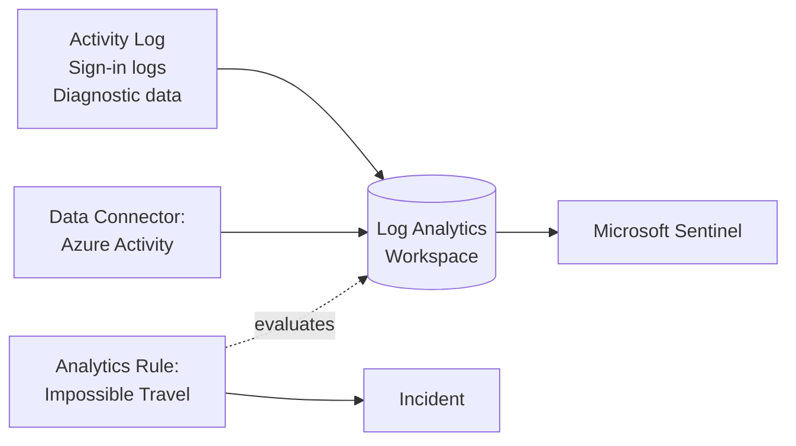

# Module 06 — Monitoring and logs

The observability layer of the **Secure Azure Administration Environment**. Centralized Log Analytics workspace with daily ingestion cap, Azure Monitor Agent on every VM via Data Collection Rules, ten saved KQL queries, three alert types (metric, log search, Activity Log), action groups, workbook, and dashboard. **Microsoft Sentinel is enabled** on the workspace with one connector and one analytics rule, then disabled to control cost.

## What this module demonstrates

| Skill | Where it shows up |
|---|---|
| Centralized observability | Single LA workspace, all module diagnostics flowing in |
| Modern monitoring agent | Azure Monitor Agent + Data Collection Rules (legacy MMA not used) |
| KQL fluency | Ten saved queries covering errors, performance, sign-ins, security, infra changes |
| Multiple alert types | Metric, log search, Activity Log alerts |
| Action groups | Email plus webhook design for fan-out |
| Workbooks and dashboards | Reusable workbook JSON, pinned dashboard with KQL tiles |
| **Sentinel enabled** | One data connector (Azure Activity), one analytics rule (impossible-travel), one captured incident |
| Cost discipline | 0.5 GB/day workspace ingestion cap |

## Build steps

Azure CLI for workspace and alert creation, KQL for query authoring, Bicep for the workspace module, Portal for workbook and dashboard, Sentinel enabled briefly via Portal.

### Steps summary

1. **Log Analytics workspace** — `law-portfolio-lab-eastus-01`, retention 30 days
2. **0.5 GB/day ingestion cap** — protects budget
3. **AMA via Data Collection Rule on a VM** — Linux Syslog + Performance counters
4. **Sample telemetry generation** — `logger -p daemon.err` 5 messages
5. **Canonical KQL search** — `Syslog | search "error"` and `Event | search "error"` for Windows
6. **Ten saved KQL queries** — error aggregation, performance threshold, sign-in geographic anomalies, NSG deny tracing, KV access by unknown callers, AAD risky users, storage anomalies, alerts by severity, resource changes, top-error hosts. Saved as workspace functions.
7. **Action group** — email + webhook stub
8. **Three alert types** — metric (CPU > 80% 5m), log search (error volume > 50 in 15m), Activity Log (resource delete)
9. **Trigger metric alert via stress test** — capture fired state and notification email
10. **Workbook with three KQL tiles** — heartbeat, performance, errors. Export JSON.
11. **Dashboard pinned with workbook + key tiles + cost view from module 01**
12. **Diagnostic settings funnel from KV, storage, NSG, Activity Log → workspace**

### 13. Microsoft Sentinel — ENABLED

Microsoft Sentinel → Add → select `law-portfolio-lab-eastus-01` workspace.

```bash
# Enable Sentinel via the SecurityInsights extension (CLI alternative)
az extension add --name sentinel
az sentinel workspace-manager-configuration create \
  --resource-group rg-platform-lab-eastus-01 \
  --workspace-name law-portfolio-lab-eastus-01 \
  --configuration-name sentinel-config
```

**Configure one data connector — Azure Activity.** Microsoft Sentinel → Data connectors → Azure Activity → Connect. Activity Log events from both subscriptions begin flowing into Sentinel.

**Author one analytics rule — impossible-travel sign-ins.** Sentinel → Analytics → Rule templates → "Impossible travel for sign-in" → Use template → set frequency 1 hour, lookback 6 hours, severity Medium. Save and Enable.

**Trigger a Sentinel incident.** Sign in from your usual location, then immediately sign in via VPN from a distant geography. Within 1 hour, Sentinel generates an incident. Capture the incident in `Sentinel → Incidents`.

**Disable Sentinel after capture.** Microsoft Sentinel → Settings → Remove. Alternatively keep enabled if budget permits — Sentinel adds ~$2.30/GB on top of LA ingestion.

## Validation

- `Heartbeat` table shows AMA-instrumented VM within 5 min.
- Daily quota set to 0.5 GB.
- Metric alert fires within 5–7 min of CPU stress; email arrives.
- Sentinel incident appears within 1 hour of impossible-travel trigger.
- Workbook JSON imports successfully into a fresh workbook.

## Cleanup

Workspace, DCR, action group, alerts are sustained baseline (~$2–4/month). Sentinel disabled after evidence to control cost. Disable any unnecessary log search alerts (most expensive at ~$1.50/month each).

**Cost:** ~$3–5/month sustained + ~$2 for the brief Sentinel enablement.

## Evidence

| File | Demonstrates |
|---|---|
| `screenshots/06-law-created.png` | Workspace overview |
| `screenshots/06-law-daily-cap.png` | Daily quota at 0.5 GB |
| `screenshots/06-dcr-association.png` | DCR associated with VM |
| `screenshots/06-ama-installed.png` | AMA extension installed |
| `screenshots/06-kql-syslog-error.png` | Syslog error query |
| `screenshots/06-kql-top-error-hosts.png` | Top error hosts aggregated |
| `screenshots/06-saved-functions.png` | Saved KQL functions |
| `screenshots/06-action-group.png` | Action group with email |
| `screenshots/06-metric-alert-fired.png` | Metric alert fired |
| `screenshots/06-log-alert.png` | Log search alert configuration |
| `screenshots/06-activity-alert.png` | Activity Log alert configuration |
| `screenshots/06-alert-email-received.png` | Email notification (redacted) |
| `screenshots/06-workbook.png` | Workbook with three KQL tiles |
| `screenshots/06-dashboard.png` | Custom dashboard pinned |
| `screenshots/06-kv-diagnostic-to-law.png` | KV diagnostic settings |
| `screenshots/06-sentinel-enabled.png` | Sentinel enabled on workspace |
| `screenshots/06-sentinel-data-connector.png` | Azure Activity connector configured |
| `screenshots/06-sentinel-analytics-rule.png` | Impossible-travel analytics rule |
| `screenshots/06-sentinel-incident.png` | Sentinel incident triggered |
| `screenshots/06-sentinel-investigation.png` | Incident investigation graph |
| `screenshots/06-traffic-analytics-from-flow-logs.png` | Traffic Analytics (cross-link from module 03) |
| `screenshots/06-vm-insights.png` | VM Insights view |
| `scripts/dcr-linux-syslog.json` | DCR for Linux |
| `scripts/dcr-windows-event.json` | DCR for Windows |
| `scripts/queries/event-error.kql` ... `storage-anomalies.kql` | Ten saved KQL queries |
| `scripts/queries/sentinel-impossible-travel.kql` | Sentinel analytics rule query |
| `scripts/workbook-vm-operations.json` | Workbook export |
| `scripts/dashboard.json` | Dashboard export |
| `diagrams/06-azmon-architecture.mmd` | Azure Monitor data plane |
| `diagrams/06-sentinel-flow.mmd` | LA workspace → Sentinel → analytics rule → incident |
| `diagrams/06-alert-fan-out.mmd` | Alert → action group → email + webhook |
| `docs/decisions/ADR-0009-centralized-law.md` | One workspace vs per-team |
| `docs/decisions/ADR-0020-sentinel-scope.md` | Sentinel enabled briefly for evidence vs sustained |

### Mermaid embedded — Sentinel flow



## Resume bullets

- Designed and deployed centralized observability for a multi-subscription Azure environment with a single Log Analytics workspace receiving diagnostic data from VMs, Key Vault, storage, NSGs, and Activity Log across both subscriptions.
- Authored ten saved KQL queries operationalizing real on-call patterns including error aggregation, performance threshold detection, sign-in geographic anomalies, NSG deny tracing, and Key Vault access by unknown callers.
- Implemented a multi-tier alerting strategy combining metric alerts, log search alerts, and Activity Log alerts, all routed through a unified action group.
- Migrated VM monitoring from the deprecated Log Analytics agent to Azure Monitor Agent with explicit Data Collection Rules.
- Enforced cost discipline on the workspace via a 0.5 GB/day ingestion cap, capturing data for evidence without exposing the lab to runaway log volumes.
- Enabled Microsoft Sentinel on the workspace with one Azure Activity data connector and one analytics rule (impossible-travel sign-ins), captured a triggered incident with investigation graph, then disabled Sentinel to control sustained cost.
- Published an Azure Monitor workbook and custom dashboard with embedded KQL queries and metric charts, exported to JSON for reproducible deployment.

## Interview stories

### Beginner — "How do you protect monitoring spend?"

The daily ingestion cap on the Log Analytics workspace, set before the first byte flows. In this lab the cap is 0.5 GB/day, sized to expected baseline plus 50%. When the cap trips, ingestion stops until the next day; the platform reverts to a known-good cost ceiling without operator intervention. Strong defaults beat strong policies.

### Intermediate — "Metric alert versus log search alert?"

Metric alerts directly measure platform-exposed metrics (CPU, network, disk). They evaluate every minute, are cheap (~$0.10/month), and fire fast. Log search alerts run a KQL query on a schedule against ingested logs. They evaluate every 5–15 minutes, cost ~$1.50/month, and can express any condition expressible in KQL. The decision rule: if the platform exposes the metric, use a metric alert; if you need to correlate or filter logs, use a log search alert. Activity Log alerts are the third type — used for control-plane events like resource deletions, role assignments, policy changes.

### Architecture — "How do you scale monitoring across a multi-subscription environment?"

Two patterns. Single workspace with cross-subscription RBAC: simpler queries (no `union workspace()` needed), one daily cap protecting total spend, one access boundary. Per-team workspaces with cross-workspace queries: cost isolation per team, access isolation per team, but query complexity rises. The portfolio chooses single workspace at lab scale, documented in ADR-0009 with the decision rule for when to switch. The architecture lesson: monitoring topology mirrors organizational topology — single workspace fits one team; many teams need many workspaces. Get the decision wrong and you either pay too much or query too painfully.

## Five-minute video script

See `videos/06-script.md`. Hook: *"In this video I'll enable Microsoft Sentinel on a Log Analytics workspace, configure one data connector, write one analytics rule, and trigger an incident — all in under five minutes."*
