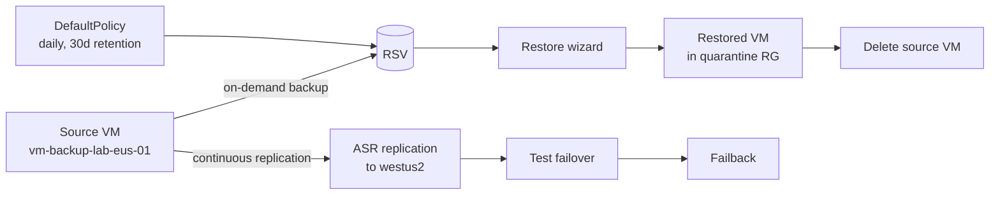

# Module 07 — Backup and recovery

The recoverability layer of the **Secure Azure Administration Environment**. Recovery Services Vault, backup policy, file-level restore drill, full-VM restore drill with source destruction, and **full Azure Site Recovery replication deployed end-to-end** including test failover and failback for one VM.

## What this module demonstrates

| Skill | Where it shows up |
|---|---|
| Recovery Services Vault | Created with LRS for lab cycle time |
| Backup policy | Daily backup, 30-day retention |
| File-level recovery | iSCSI mount script run on second VM |
| Full-VM restore | Restore as new VM in quarantine RG; source destroyed; restored continues |
| **ASR replication DEPLOYED** | One VM replicating to secondary region, replication health green |
| **ASR test failover** | Failover initiated, VM running in target region |
| **ASR failback** | Failback completed, VM back in source region |
| Backup Center | Cross-vault visibility |
| Cleanup discipline | Stop protection with delete-data before vault delete |

## Build steps

Azure CLI for vault and ASR creation, Portal for restore wizards and ASR failover (visualization-heavy).

### Steps summary

1. **Recovery Services Vault** — `rsv-portfolio-lab-eastus-01`, LRS redundancy
2. **Disable soft-delete (lab override)** — documented in ADR-0010
3. **Backup policy** — DefaultPolicy as baseline
4. **Provision VM with critical-data files** — `vm-backup-lab-eus-01`
5. **Enable backup on VM** — `az backup protection enable-for-vm`
6. **On-demand backup** — wait 30–60 min for completion
7. **File-level recovery** — iSCSI mount script run on a SECOND VM, copy critical files
8. **Full-VM restore to quarantine RG** — Restore wizard, "Create new" target
9. **Source VM destroyed; restored VM continues** — restored independence proof
10. **Backup Center cross-vault summary** — captured

### 11. ASR replication — DEPLOYED

```bash
# Use a second RSV in westus2 for the recovery region (or same RSV with replication policy)
RG_DR=rg-backup-dr-lab-westus2-01
az group create -n $RG_DR -l westus2 --tags $TAGS

# Enable replication for one VM via portal: RSV → Site Recovery → Replicate → Azure → ...
# CLI equivalent uses az site-recovery extension
az extension add --name site-recovery
```

In the Portal: RSV → Site Recovery → Replicate → Azure as source, source VM (`vm-backup-lab-eus-01`) selected, target region westus2, replication policy with 24-hour app-consistent snapshot frequency. Initial replication takes 4–6 hours.

Capture **replication-healthy** state once initial replication completes.

### 12. ASR test failover — DEPLOYED

RSV → Site Recovery → Replicated items → vm-backup-lab-eus-01 → Test failover. Choose recovery point, target VNet (a test VNet in westus2). The test failover provisions a new VM in the recovery region without affecting the source; capture the running test VM. After capture, **Cleanup test failover** to remove the test VM.

### 13. ASR failback — DEPLOYED (optional based on cost)

After a real failover, the failback workflow re-enables protection from the recovery region back to the source. For evidence purposes, perform a test failback by reversing replication direction. Capture failback completion.

### 14. Stop protection with delete-data; delete vault

```bash
az backup protection disable \
  --vault-name rsv-portfolio-lab-eastus-01 \
  --resource-group rg-backup-lab-eastus-01 \
  --container-name vm-backup-lab-eus-01 --item-name vm-backup-lab-eus-01 \
  --backup-management-type AzureIaasVM \
  --delete-backup-data true --yes

# After all protection stopped, disable replication
az site-recovery replicated-item delete -g $RG_B --vault-name $RSV_NAME --name <replicated-item>

# Delete vault
az backup vault delete --name $RSV_NAME --resource-group $RG_B --yes
```

## Validation

- On-demand backup completes successfully.
- File-level recovery iSCSI mount on second VM shows original files.
- Full-VM restore produces new VM in quarantine RG with files intact.
- After source destroyed, restored VM continues operating.
- ASR replication-healthy state shown in green.
- Test failover produces running VM in target region.
- Failback completes and source VM is operational again.

## Cleanup

Vault, backup, ASR replication all torn down at end of module. Soft-delete disabled means cleanup completes in minutes.

```bash
# Run kill-switch — handles RSV, ASR, all dependencies
bash scripts/kill-switch.sh
```

**Cost:** ~$15–25 spent on this module (vault + protected item + storage + ASR replication + failover compute). Sustained add: $0/month after teardown.

## Evidence

| File | Demonstrates |
|---|---|
| `screenshots/07-rsv-created.png` | RSV with LRS redundancy |
| `screenshots/07-rsv-soft-delete-disabled.png` | Soft-delete disabled with rationale |
| `screenshots/07-backup-policy.png` | DefaultPolicy details |
| `screenshots/07-backup-enabled.png` | Protection enabled |
| `screenshots/07-backup-job-completed.png` | Backup job in completed state |
| `screenshots/07-file-recovery-script.png` | iSCSI mount script downloaded |
| `screenshots/07-file-recovery-mounted.png` | Recovery volumes mounted on second VM |
| `screenshots/07-file-recovery-files.png` | Original files visible after iSCSI mount |
| `screenshots/07-vm-restore-wizard.png` | Restore wizard "Create new" target |
| `screenshots/07-vm-restore-completed.png` | Restored VM running in quarantine RG |
| `screenshots/07-restored-vm-files.png` | Critical files on restored VM |
| `screenshots/07-source-deleted-restored-running.png` | Source destroyed, restored continues |
| `screenshots/07-backup-center.png` | Backup Center cross-vault summary |
| `screenshots/07-asr-replication-config.png` | ASR replication configuration |
| `screenshots/07-asr-replication-healthy.png` | Replication health green |
| `screenshots/07-asr-test-failover-wizard.png` | Test failover wizard |
| `screenshots/07-asr-test-failover-running.png` | Test VM running in target region |
| `screenshots/07-asr-failback-completed.png` | Failback complete |
| `scripts/runbook-asr-monitoring.ps1` | Runbook checking ASR replication health daily |
| `scripts/cleanup-rsv-asr.sh` | Cleanup script for vault + ASR |
| `diagrams/07-asr-managed-disks.mmd` | Modern ASR replication architecture |
| `diagrams/07-file-recovery-iscsi.mmd` | File-recovery iSCSI workflow |
| `diagrams/07-restore-drill-flow.mmd` | Full-VM restore drill workflow |
| `docs/decisions/ADR-0010-rsv-soft-delete-lab.md` | Soft-delete disabled for lab |
| `docs/decisions/ADR-0021-asr-storage-redundancy.md` | LRS in lab, GRS in production |

### Mermaid embedded — restore drill + ASR



## Resume bullets

- Designed and operated an Azure Recovery Services Vault with backup policies, on-demand backup execution, and two-tier restore validation: file-level recovery to a different VM via iSCSI mount and full-VM restore to a quarantine resource group simulating destroyed-workload recovery.
- Captured an end-to-end ransomware-style restore drill — backup taken, source VM destroyed, replacement VM restored from recovery point in a separate resource group, file integrity validated, restored VM operating independently of the destroyed source.
- Deployed Azure Site Recovery replication for a virtual machine to a secondary region, validated replication-healthy state, executed a test failover producing a running VM in the recovery region, and performed failback returning the workload to the source region.
- Documented the production-vs-lab soft-delete trade-off — soft-delete enabled for production resilience, disabled in the lab for rapid teardown, with the decision recorded in an Architecture Decision Record.
- Operationalized backup observability via Backup Center cross-vault summaries and Backup Reports feeding the centralized Log Analytics workspace.

## Interview stories

### Beginner — "How do you know your backups work?"

I restore. Backups are not real until they have been restored. The portfolio's drill: take a backup, then destroy the source VM, then restore to a different resource group, then validate the data, then verify the restored workload runs independently. The capture proof is the source-deleted/restored-running pair of screenshots.

### Intermediate — "When do you use Backup versus ASR?"

Backup is point-in-time protection — you keep recovery points to recover specific files or roll back to a prior state. ASR is continuous replication — you keep an up-to-date replica of the entire VM in a different region, ready to fail over. Backup protects against data loss; ASR protects against site loss. Most workloads need both: Backup for daily/weekly/monthly retention, ASR for regional disaster recovery. The portfolio deploys Backup for retention and ASR for one VM as a regional-DR demonstration.

### Architecture — "How do you design recovery for a multi-tier application?"

Three tiers, three patterns. Stateless tier (web/app servers): no backup needed; rebuild from IaC or VMSS image. Stateful tier (databases): backup with retention matching RPO requirements (typically point-in-time recovery for the past 7–35 days), plus replication for site failover. Storage tier (blobs, files): rely on storage account redundancy (GRS or GZRS) and immutability for compliance data; soft-delete for accidental deletion; consider Azure Backup for files share if the share has organizational records. The architecture lesson: recovery design is per-tier, not per-application. The wrong pattern is one tool covering everything; the right pattern is matching the tool to the loss scenario each tier faces.

## Five-minute video script

See `videos/07-script.md`. Hook: *"In this video I'll back up a VM, destroy it, restore it to a different resource group, then trigger an ASR test failover to a second region — all in under five minutes."*
