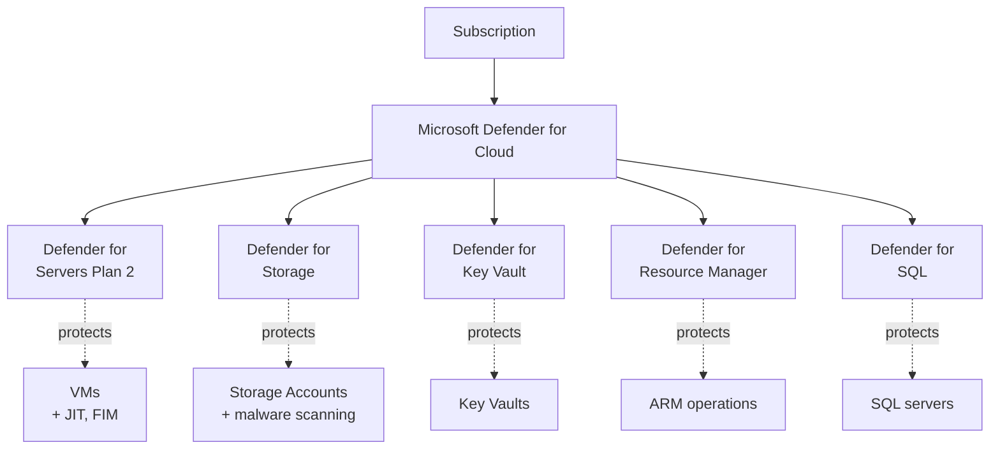

# Module 08 — Security operations

The security plane of the **Secure Azure Administration Environment**. Key Vault in RBAC permission mode, Managed Identity end-to-end secret-fetch pattern, customer-managed keys for storage encryption, KV firewall, and **Microsoft Defender for Cloud all five major plans enabled briefly** (Defender for Servers Plan 2, Defender for Storage, Defender for Key Vault, Defender for Resource Manager, Defender for SQL) with secure score before/after, JIT VM access, and full plan teardown via kill-switch.

## What this module demonstrates

| Skill | Where it shows up |
|---|---|
| Modern Key Vault posture | RBAC permission mode with role granularity |
| Managed Identity end-to-end | VM gets MI, role-assigned to KV, fetches secret via `az login --identity` |
| User-assigned MI | One identity, multiple VMs sharing a KV grant |
| **Defender for Cloud all major plans** | Plan 2 / Storage / KV / ARM / SQL all enabled briefly |
| Secure score before/after | Pre-remediation, post-remediation, paired evidence |
| JIT VM access | Time-bounded NSG opens with approval workflow |
| Customer-managed keys | Storage encryption rotated to KV-stored key |
| KV firewall | IP allowlist, validated by denied connection |
| KQL alert on KV | Saved query alerting on access by unknown service principals |

## Build steps

Azure CLI for KV, MI, role grants. Bicep for KV templates. Portal for Defender screenshots (richer visualization).

### Steps summary

1. **Key Vault in RBAC permission mode** — `--enable-rbac-authorization true`, soft-delete + purge protection
2. **Self-grant Key Vault Administrator** — required because RBAC mode is in effect
3. **Add secret, certificate, key**
4. **KV diagnostic settings to LA workspace** — AuditEvent + AzurePolicyEvaluationDetails
5. **KQL alert for unknown-caller KV access** — saved query, log search alert
6. **VM with system-assigned MI** — `--assign-identity '[system]'`, role-assigned `Key Vault Secrets User`
7. **Validate `az login --identity` from VM and secret fetch** — capture redacted
8. **User-assigned MI shared across two VMs** — one identity, one grant, multiple resources
9. **CMK for storage encryption** — Storage account MI granted Crypto Service Encryption User on KV; storage encryption rotated to KV key with auto-rotation enabled
10. **KV firewall IP allowlist** — restrict to your IP, capture deny from outside

### 11. Microsoft Defender for Cloud — ALL major plans enabled briefly

```bash
# Enable all five plans
for plan in VirtualMachines:P2 StorageAccounts:DefenderForStorageV2 KeyVaults:Free Arm:PerSubscription SqlServers:Free; do
  PLAN_NAME=${plan%%:*}
  TIER=${plan##*:}
  az security pricing create -n $PLAN_NAME --tier Standard --subplan $TIER 2>/dev/null || \
  az security pricing create -n $PLAN_NAME --tier Standard
done

# Verify
az security pricing list -o table
```

**Defender for Servers Plan 2** — adds JIT VM access, file integrity monitoring, adaptive application controls. Capture screenshot.

**Defender for Storage** — adds malware scanning on uploaded blobs, sensitive data discovery. Capture.

**Defender for Key Vault** — alerts on suspicious KV access patterns (unusual user, unusual location). Capture.

**Defender for Resource Manager** — alerts on suspicious ARM operations (mass deletes, role assignment changes from unusual sources). Capture.

**Defender for SQL** — even without a SQL deployment, capture the plan-enabled state.

### 12. Secure score before/after

Capture secure score before applying any remediation (baseline). Apply three highest-impact recommendations: enable MFA on accounts with Owner permissions (covered in module 02 CA), restrict storage public access (module 05), enable diagnostic logging on Key Vault (step 4). Wait 24 hours; capture secure score after.

### 13. JIT VM access via Defender for Servers

Defender for Cloud → Workload protections → Just-in-time VM access → Configure for `vm-mi-lab-eus-01`. SSH (port 22) with maximum 3-hour open window, source IP "Request IP". Demonstrate request workflow: request, temporary NSG rule appears, SSH succeeds, NSG rule disappears at timeout.

### 14. Disable all paid Defender plans

```bash
# Critical cost cleanup
for plan in VirtualMachines StorageAccounts KeyVaults Arm SqlServers; do
  az security pricing create -n $plan --tier Free
done
```

## Validation

- KV in RBAC mode confirmed by `properties.enableRbacAuthorization`.
- VM with MI runs `az login --identity && az keyvault secret show` successfully.
- Same secret-fetch attempt from VM without role grant fails.
- All five Defender plans show Standard tier briefly.
- Secure score increases measurably 24 hours after remediation.
- JIT request opens NSG rule for 3 hours, then auto-removes.
- Storage encryption blade shows customer-managed key reference.
- Connecting to KV from non-allowlisted IP returns 403.

## Cleanup

KV is sustained baseline (~$0.10/month). User-assigned MI free. Test VMs torn down. **All paid Defender plans reverted to Free.**

```bash
# Verify Defender plans back to Free
az security pricing list --query "value[?pricingTier=='Standard'].name" -o tsv
# Should return empty
```

**Cost:** ~$5–15 spent on this module. Sustained add: <$1/month.

## Evidence

| File | Demonstrates |
|---|---|
| `screenshots/08-kv-rbac-mode.png` | KV with RBAC permission mode |
| `screenshots/08-kv-roles-list.png` | Available KV roles |
| `screenshots/08-kv-secret-cert-key.png` | Secret, cert, key in vault |
| `screenshots/08-kv-diagnostic-settings.png` | Diagnostic settings to LA |
| `screenshots/08-vm-mi-enabled.png` | VM with system-assigned MI |
| `screenshots/08-mi-role-on-kv.png` | MI granted KV Secrets User |
| `screenshots/08-az-login-identity-success.png` | `az login --identity` token |
| `screenshots/08-mi-fetches-secret.png` | Secret fetched via MI (value redacted) |
| `screenshots/08-uami-attached-multi-vm.png` | User-assigned MI on two VMs |
| `screenshots/08-defender-baseline.png` | Secure score before remediation |
| `screenshots/08-defender-servers-p2.png` | Defender for Servers Plan 2 enabled |
| `screenshots/08-defender-storage.png` | Defender for Storage enabled |
| `screenshots/08-defender-keyvault.png` | Defender for Key Vault enabled |
| `screenshots/08-defender-arm.png` | Defender for Resource Manager enabled |
| `screenshots/08-defender-sql.png` | Defender for SQL enabled |
| `screenshots/08-defender-all-plans-overview.png` | All five plans visible |
| `screenshots/08-defender-after.png` | Secure score after remediation |
| `screenshots/08-jit-config.png` | JIT VM access policy |
| `screenshots/08-jit-request-allowed.png` | JIT request approved with temp NSG rule |
| `screenshots/08-jit-rule-expired.png` | NSG rule absent after timeout |
| `screenshots/08-storage-cmk.png` | Storage encryption with KV-stored key |
| `screenshots/08-kv-firewall.png` | KV firewall with IP allowlist |
| `screenshots/08-kv-firewall-deny.png` | 403 from non-allowlisted IP |
| `screenshots/08-kql-alert-unknown-caller.png` | Saved log search alert |
| `screenshots/08-defender-recommendations-list.png` | Recommendations applied |
| `scripts/sample-bicep-with-getsecret.bicep` | Bicep with `getSecret()` |
| `scripts/queries/kv-unknown-caller.kql` | Unknown-caller KQL query |
| `scripts/enable-defender-plans.sh` | Defender plan enablement |
| `scripts/disable-defender-plans.sh` | Defender plan teardown |
| `diagrams/08-mi-to-kv-flow.mmd` | VM → MI → role → KV → secret |
| `diagrams/08-cmk-flow.mmd` | Storage encryption with KV CMK |
| `diagrams/08-defender-coverage.mmd` | Defender plans across the subscription |
| `diagrams/08-jit-flow.mmd` | JIT request workflow |
| `docs/decisions/ADR-0011-rbac-vs-access-policies.md` | KV RBAC over access policies |
| `docs/decisions/ADR-0012-system-vs-user-mi.md` | MI selection rules |
| `docs/decisions/ADR-0013-cmk-vs-pmk.md` | CMK for storage |
| `docs/decisions/ADR-0019-defender-strategy.md` | Defender plan enablement strategy and cost discipline |

### Mermaid embedded — Defender coverage



## Resume bullets

- Configured Microsoft Azure Key Vault in RBAC permission mode (the current Microsoft-recommended posture) with role-granular access for Secrets User, Crypto User, and Administrator scopes, replacing the legacy access-policies model across all secret-handling integrations.
- Implemented the system-assigned Managed Identity pattern end-to-end: VM provisioned with platform-managed identity, role-assigned `Key Vault Secrets User` on the vault, validated by runtime `az login --identity` and successful secret fetch with no stored credentials.
- Designed the user-assigned Managed Identity pattern for shared-secret access across multiple VMs, with one identity granted once and attached to a fleet of resources.
- Operationalized Microsoft Defender for Cloud across all five major plans (Defender for Servers Plan 2, Defender for Storage, Defender for Key Vault, Defender for Resource Manager, Defender for SQL) with documented secure-score before and after applying recommendations.
- Implemented Just-in-Time VM access via Defender for Servers Plan 2, replacing always-open management ports with time-bounded approval-gated NSG rules.
- Migrated storage encryption from Microsoft-managed keys to customer-managed keys (CMK) stored in Key Vault with automatic key rotation enabled.
- Authored a KQL log search alert that fires when Key Vault is accessed by an identity outside a known principal list.
- Configured KV firewall with IP allowlist, validated by intentional denied connection from outside the allowlist.

## Interview stories

### Beginner — "How does an application authenticate to Key Vault without storing credentials?"

The VM has a Managed Identity. Microsoft Entra ID issues it a token at the platform level. The token grants `Key Vault Secrets User` on a specific vault. The application calls the Key Vault SDK with that token, retrieves the secret at startup. Never stored in the image, never in a config file, never in an environment variable, never on disk. Eliminate the credential by construction.

### Intermediate — "Which Defender plans do you enable, and when?"

The decision rule: enable a plan when the workload class it protects is in production. Defender for Servers Plan 2 for any production VM (adds JIT, file integrity monitoring, adaptive controls). Defender for Storage when storage accounts hold uploaded user content (adds malware scanning). Defender for Key Vault always, because compromised KV is high blast radius. Defender for Resource Manager always, because it catches mass-delete and role-assignment-change attacks across the subscription. Defender for SQL when SQL Servers are deployed. The portfolio enables all five briefly to capture evidence; production keeps a subset based on workload mix. The cost discipline is in ADR-0019.

### Architecture — "How do you design the credential model for an application platform?"

Three layers. Identity layer: every workload has its own identity (Managed Identity or workload identity). Authorization layer: roles assigned to identities at the smallest scope satisfying the workload's needs. Credential layer: no credentials in the workload — the platform issues tokens at runtime. The portfolio demonstrates the pattern at every level: VMs use system-assigned MI (this module), Automation Account uses system-assigned MI (module 09), GitHub Actions uses OIDC federation (module 09). The architectural point is that credential elimination is a design pattern that compounds: once the pattern is in place, every new workload follows it, and the credential-leak threat model goes to zero. Anyone still rotating service principal secrets in 2026 is shipping outdated infrastructure.

## Five-minute video script

See `videos/08-script.md`. Hook: *"In this video I'll show how a virtual machine authenticates to Key Vault without storing any credentials — and why this pattern eliminates the credential-leak threat model entirely."*
