# Module 09 — Infrastructure as code and automation

The automation plane of the **Secure Azure Administration Environment**. Bicep modules for the entire architecture, GitHub Actions deployment via OIDC federated credentials (no stored secrets), Resource Group → Deployments blade as the canonical "where did this template come from" lookup path, Azure Automation Account with system-assigned Managed Identity (replacing the deprecated Run-As Account pattern), PowerShell runbooks for VM start/stop scheduling and ExpiryDate tag governance reporting, and the kill-switch script that tears down all build-and-tear-down resources at end of session.

## What this module demonstrates

| Skill | Where it shows up |
|---|---|
| Bicep module authoring | Reusable modules: vnet, nsg, storage, KV, VM-with-KV-secret, firewall, app-gateway, front-door |
| Idempotent deployments | What-if dry-run, parameter file environments, redeploy from clean RG |
| GitHub Actions CI/CD | OIDC federated credential, no client secret in repo |
| RG → Deployments blade | Canonical answer for finding deployment templates |
| Automation Account | System-assigned MI (no Run-As Account), PowerShell runbooks |
| Scheduled cost optimization | VM auto-shutdown nightly, weekday-only auto-start |
| Tag-driven cleanup | Runbook flagging resources past `ExpiryDate` |
| **Kill-switch script** | Single command tears down all build-and-tear-down resources |

## Build steps

Bicep for infrastructure, GitHub Actions YAML for CI/CD, PowerShell for runbooks, Bash for kill-switch and orphan audit.

### Steps summary

1. **Bicep workspace initialization** — `main.bicep` orchestrator, `modules/` folder
2. **Bicep modules** — vnet, nsg, storage, keyvault, vm-with-kv-secret, firewall, app-gateway, front-door
3. **What-if dry-run** — `az deployment group what-if` shows diff before deploy
4. **Deploy** — `az deployment group create`
5. **RG → Deployments blade** — capture deployment list with template, parameters, outputs
6. **Tear down RG, redeploy from Bicep** — idempotency proof
7. **App registration with federated credential** — `subject` scoped to `repo:.../ref:refs/heads/main`
8. **GitHub Actions deploy workflow** — OIDC login, what-if step, deploy step
9. **Successful CI deployment captured**
10. **Automation Account with system-assigned MI** — replaces deprecated Run-As Account
11. **VM start/stop runbook** — schedules: stop daily 19:00, start weekdays 08:00
12. **ExpiryDate cleanup runbook** — daily 09:00, reports stale resources, doesn't auto-delete
13. **Logic App alternative design** — for connector-driven event automation

### 14. Kill-switch script

`scripts/kill-switch.sh` is the operational discipline that makes deployed-not-designed sustainable. At end of any session that touched expensive resources, run it. Idempotent — safe on a clean baseline.

```bash
bash scripts/kill-switch.sh
```

The script tears down: Firewall, Application Gateway, VPN Gateway, Front Door, Bastion, Internal Load Balancer; reverts all five Defender plans to Free; deletes test VMs; sweeps orphan disks, NICs, public IPs.

### 15. Orphan-resource audit

`scripts/cleanup-orphans.sh` lists (does not delete) the four most common cost-leak categories: unattached managed disks, unattached public IPs, unattached NICs, resources past their ExpiryDate. Run weekly minimum.

## Validation

- What-if returns non-empty diff against empty RG, empty diff against same-state RG (idempotency).
- GitHub Actions workflow run completes with both what-if and deploy green.
- Deployments blade shows template, parameters, outputs viewable.
- Runbook system-assigned MI authenticates to Azure successfully.
- Manually triggering VM start/stop runbook deallocates lab VMs.
- Kill-switch script reverts paid Defender plans and deletes expensive transient resources.

## Cleanup

Bicep modules, GitHub Actions workflow, Automation Account, runbooks are sustained baseline. The `rg-iac-lab-eastus-01` resource group's deployment artifacts can be cleaned after evidence:

```bash
az group delete -n rg-iac-lab-eastus-01 --yes --no-wait
az group create -n rg-iac-lab-eastus-01 --location eastus --tags $TAGS
```

**Cost:** $0 incremental (Automation 500 min/month free, GitHub Actions free for public repos). Sustained add: $0/month.

## Evidence

| File | Demonstrates |
|---|---|
| `screenshots/09-bicep-what-if.png` | What-if diff output |
| `screenshots/09-deployment-success.png` | Successful deployment |
| `screenshots/09-rg-deployments-blade.png` | RG → Deployments showing template history |
| `screenshots/09-deployment-template-view.png` | Template view of a deployment |
| `screenshots/09-redeploy-from-clean.png` | RG deleted, recreated, redeployed — same resources |
| `screenshots/09-app-registration.png` | App registration with federated credential |
| `screenshots/09-federated-credential.png` | Federated credential subject |
| `screenshots/09-gh-actions-success.png` | GitHub Actions run completed |
| `screenshots/09-aa-mi-enabled.png` | Automation Account with system-assigned MI |
| `screenshots/09-runbook-published.png` | Runbook in published state |
| `screenshots/09-schedule-stop-19.png` | Stop schedule daily at 19:00 |
| `screenshots/09-schedule-start-weekdays.png` | Start schedule weekdays 08:00 |
| `screenshots/09-runbook-job-output.png` | Runbook job log output |
| `screenshots/09-expiry-cleanup-output.png` | ExpiryDate cleanup runbook output |
| `screenshots/09-kill-switch-output.png` | Kill-switch script terminal output |
| `screenshots/09-orphan-audit-output.png` | Orphan audit listing stale resources |
| `scripts/main.bicep` | Top-level orchestrator |
| `scripts/modules/vnet.bicep` | VNet module |
| `scripts/modules/nsg.bicep` | NSG module |
| `scripts/modules/storage.bicep` | Storage module |
| `scripts/modules/keyvault.bicep` | KV module |
| `scripts/modules/vm-with-kv-secret.bicep` | VM with `getSecret()` |
| `scripts/modules/firewall.bicep` | Firewall module |
| `scripts/modules/app-gateway.bicep` | AppGW module |
| `scripts/modules/front-door.bicep` | Front Door module |
| `scripts/parameters/lab.json` | Parameter file |
| `scripts/parameters/dev.json` | Parameter file |
| `scripts/runbook-vm-schedule.ps1` | VM start/stop runbook |
| `scripts/runbook-expiry-cleanup.ps1` | Expiry cleanup runbook |
| `scripts/kill-switch.sh` | End-of-session teardown |
| `scripts/cleanup-orphans.sh` | Daily orphan audit |
| `.github/workflows/deploy-iac.yml` | OIDC-authenticated deploy workflow |
| `.github/workflows/destroy.yml` | Tagged resource teardown workflow |
| `diagrams/09-cicd-flow.mmd` | GitHub Actions → OIDC → ARM |
| `diagrams/09-bicep-module-graph.mmd` | Bicep module dependencies |
| `diagrams/09-automation-runbook-flow.mmd` | Runbook → MI → Azure resources |
| `docs/decisions/ADR-0014-bicep-over-arm-json.md` | Bicep over ARM JSON |
| `docs/decisions/ADR-0015-oidc-over-secrets.md` | OIDC over service principal secrets |

### Mermaid embedded — CI/CD flow with OIDC

```mermaid
flowchart LR
    Push[git push origin main]
    GHA[GitHub Actions runner]
    OIDC[GitHub OIDC token]
    Entra[Microsoft Entra ID<br/>federated credential]
    AT[Short-lived access token]
    Deploy[az deployment group create]
    ARM[Azure Resource Manager]
    RG[rg-iac-lab-eastus-01]

    Push --> GHA
    GHA -->|exchanges| OIDC
    OIDC -->|verified by subject<br/>repo:.../ref:refs/heads/main| Entra
    Entra --> AT
    AT --> Deploy
    Deploy --> ARM
    ARM --> RG
```



## Resume bullets

- Authored a complete Bicep module library (VNet, NSG, storage, Key Vault, Firewall, Application Gateway, Front Door, VM-with-KV-secret-reference) with parameter files for multiple environments, deployed via `az deployment group create` and validated for idempotency by RG-delete-and-redeploy cycles.
- Built a GitHub Actions CI/CD pipeline using OIDC federated credentials, eliminating long-lived service principal secrets from the repository while scoping the credential to a specific repo and branch via the federation subject.
- Operationalized a daily what-if dry-run pattern in the deploy workflow, surfacing infrastructure diffs before applying changes.
- Implemented an Azure Automation Account with system-assigned Managed Identity (replacing the deprecated Run-As Account pattern) running PowerShell runbooks for scheduled VM start/stop and daily ExpiryDate-based tag governance reporting, achieving roughly 70% compute cost reduction compared to a 24×7 baseline.
- Authored a kill-switch script tearing down all build-and-tear-down resources (Firewall, Application Gateway, VPN Gateway, Front Door, Bastion, Internal Load Balancer, paid Defender plans) at end of session, making deployed-not-designed evidence sustainable on a $300 budget.
- Captured the Resource Group → Deployments blade workflow as the canonical path for "find the template that deployed this resource."
- Documented the decision to use OIDC federation over client-secret service principals as ADR-0015, with the federation subject as the security boundary.

## Interview stories

### Beginner — "How does GitHub Actions authenticate to Azure?"

OIDC federation. The workflow presents an OIDC token at the start of each run. Microsoft Entra ID is configured with a federated credential whose subject string is `repo:<org>/<repo>:ref:refs/heads/main`. Only a workflow running on the main branch of that specific repo can complete the federation. No client secret stored, no rotation policy needed.

### Intermediate — "Why Bicep over ARM JSON?"

Bicep transpiles to ARM at deploy time — same backend, terser syntax. Modules are first-class. Type checking catches errors before deploy. What-if dry-run shows the diff. The portfolio uses Bicep for everything; ARM JSON appears only when reading exported deployment templates from the RG → Deployments blade. Anyone authoring new ARM JSON in 2026 is choosing the harder path for no benefit.

### Architecture — "How do you make deployed-not-designed sustainable on a tight budget?"

Three disciplines layered. First, build-then-tear-down on every expensive resource — Firewall, AppGW, VPN GW, Front Door deployed for a session, captured, deleted. Second, a single kill-switch script that runs at end of session — idempotent, safe on a clean baseline, removes everything in the build-and-tear-down catalog including all paid Defender plans. Third, an orphan audit that runs weekly catching what the kill-switch missed. The architecture lesson is that cost discipline at scale is automation, not vigilance — relying on humans remembering to clean up always fails. The script is the discipline.

## Five-minute video script

See `videos/09-script.md`. Hook: *"In this video I'll deploy a Bicep template through GitHub Actions using OIDC federated credentials — no client secret in the repo, no rotation, no leak risk by construction."*
