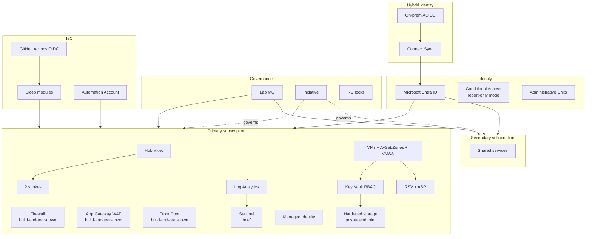

# Module 10 — Final capstone

The integration phase of the **Secure Azure Administration Environment**. Eight intentional troubleshooting drills, end-to-end redeployment from clean state proving Bicep idempotency, cost actuals roll-up across both subscriptions, final orphan audit, and the capstone narrative.

The capstone README is the document a hiring manager reads if they only read one — it must summarize the entire portfolio with verifiable evidence in two minutes.

## What this module demonstrates

| Skill | Where it shows up |
|---|---|
| End-to-end integration | Resources from all 12 modules referenced and verified together |
| Troubleshooting under fault conditions | Eight drills with diagnose/fix/after evidence |
| Reproducibility | Module rebuilt from clean state via Bicep CI/CD pipeline |
| Cost discipline outcome | Actuals vs $300 budget across both subscriptions |
| Operational maturity | 22 ADRs cross-linked, evidence indexed |

## Build steps

CLI for verification, Portal for visualization, Bicep for redeployment, KQL for diagnostic queries.

### 1. Cross-module integration verification

Confirm resources from each module reference each other as designed. Capture in a master Mermaid diagram.

### 2. Eight troubleshooting drills

Each follows: break → symptom → diagnose → fix → verify.

**Drill 1 — Broken peering.** Disable `useRemoteGateways` on spoke side. Use Network Watcher Connection Troubleshoot to surface missing transit configuration. Re-enable, verify.

**Drill 2 — NSG denies legitimate traffic.** Add inbound NSG rule priority 90 denying TCP. HTTPS to web server stops. IP Flow Verify names the denying rule. Delete rogue rule.

**Drill 3 — RBAC failure under Contributor.** Test user with only Contributor attempts role assignment. AuthorizationFailed. Grant UAA scoped to specific resource. Same operation succeeds at that resource scope only.

**Drill 4 — Backup restore to wrong RG.** Initiate full-VM restore, choose wrong target RG. After restore, use `az resource move` to relocate VM, NIC, OS disk, data disks together to correct RG.

**Drill 5 — KQL alert false positive.** Saved alert from module 08 fires every 15 min because GitHub Actions deploy SP isn't in known-principals list. Update saved function to add deploy SP. Alert quiets.

**Drill 6 — Firewall rule blocks legitimate egress.** Application rule `*.contoso.com` doesn't match the actual FQDN the workload requires. Capture Firewall log, identify FQDN, add to allowlist.

**Drill 7 — ASR replication unhealthy.** Network change blocks replication traffic. Identify via replication health blade. Restore network rule. Replication recovers.

**Drill 8 — Conditional Access lockout simulation.** Deploy a CA policy in Report-only first (the discipline from module 02). Review sign-in logs. Discover the policy would lock out the break-glass account. Add break-glass exclusion. Promote to On.

### 3. End-to-end redeployment

Capture current state of `rg-iac-lab-eastus-01` as baseline. Destroy. Recreate empty RG. Trigger GitHub Actions workflow. Compare resource list against baseline — empty diff (modulo timestamps and unique IDs).

### 4. Cost actuals roll-up

Per-month table for the project lifetime: sustained baseline + within-session bursts + total + variance against $100/month budget. Both subscriptions. Goal: $300 total project actual under budget.

### 5. Final orphan audit

Run `cleanup-orphans.sh`. Resolve any orphans. Expectation at end: zero orphans across all four checks.

### 6. Capstone narrative

Architecture overview with master Mermaid (12 modules + their primary resources + relationships). Module index. Lessons learned (5 paragraphs: RBAC scope discipline, build-then-tear-down, centralized LA workspace, OIDC, restore drill). Skills demonstrated table. ADR index. Future work.

## Validation

- Cross-module integration diagram matches actual deployed dependency graph.
- All eight drills have before/diagnose/fix/after evidence.
- Redeployment diff against baseline is empty for resource identity.
- Orphan audit returns empty across all four checks.
- Cost actuals stay below $300 total against budget cap.

## Cleanup

This module's "cleanup" is the end-of-portfolio teardown sequence in `cost-and-cleanup.md`. The decision to tear down or keep the lab is a personal trade-off — keeping it costs $15–25/month sustained.

**Cost:** $0 incremental beyond drill costs already counted in earlier modules.

## Evidence

| File | Demonstrates |
|---|---|
| `screenshots/10-cross-module-integration.png` | Verification commands across modules |
| `screenshots/10-drill1-peering-broken.png` ... `peering-fixed.png` | Drill 1 |
| `screenshots/10-drill2-https-fails.png` ... `https-restored.png` | Drill 2 |
| `screenshots/10-drill3-contributor-fails.png` ... `assign-succeeds.png` | Drill 3 |
| `screenshots/10-drill4-vm-in-wrong-rg.png` ... `vm-in-correct-rg.png` | Drill 4 |
| `screenshots/10-drill5-alert-flooding.png` ... `alert-quiet.png` | Drill 5 |
| `screenshots/10-drill6-firewall-blocks.png` ... `firewall-allows.png` | Drill 6 |
| `screenshots/10-drill7-asr-unhealthy.png` ... `asr-healthy.png` | Drill 7 |
| `screenshots/10-drill8-ca-report-only-lockout-detected.png` ... `ca-with-breakglass.png` | Drill 8 |
| `screenshots/10-redeploy-workflow-success.png` | GitHub Actions redeploy run |
| `screenshots/10-redeploy-diff-empty.png` | Diff baseline vs redeployed empty |
| `screenshots/10-cost-actuals-by-month.png` | Cost Analysis monthly by Module tag |
| `screenshots/10-cost-cross-sub-rollup.png` | MG-scope cost view across both subscriptions |
| `screenshots/10-final-orphan-audit-clean.png` | Orphan audit empty |
| `screenshots/10-master-architecture-diagram.png` | Master Mermaid diagram rendered |
| `screenshots/10-evidence-index-totals.png` | Evidence count summary |
| `scripts/run-all-drills.sh` | Drill orchestration script |
| `scripts/redeploy-test.sh` | Redeploy from clean script |
| `diagrams/10-final-architecture.mmd` | Master architecture |
| `diagrams/10-cross-module-dependencies.mmd` | Inter-module dependency graph |
| `docs/lessons-learned.md` | Five-paragraph reflection |
| `docs/skills-demonstrated.md` | Skills-to-evidence mapping |
| `docs/future-work.md` | What would be added with more time or budget |
| `docs/cost-summary.md` | Final cost table all months |

### Mermaid embedded — final integrated architecture

## Resume bullets

- Operated eight intentional troubleshooting drills end-to-end (peering misconfiguration, NSG rule conflict, RBAC permission gap, backup-restore wrong-target, monitoring alert tuning, Firewall application rule mismatch, ASR replication unhealthy, Conditional Access lockout simulation) with documented diagnose-fix evidence proving operational readiness under fault conditions.
- Performed an end-to-end infrastructure redeployment from a destroyed resource group, validated by an empty diff against the pre-destruction baseline, demonstrating Bicep IaC reproducibility.
- Maintained sustained Azure spend below $25/month against a $100/month per-subscription budget across the project lifetime, with cost actuals captured monthly across two subscriptions and grouped by the `Module` tag.
- Authored a 22-entry Architecture Decision Record series capturing rationale for hub-and-spoke topology, multi-subscription MG hierarchy, RBAC mode for Key Vault, OIDC federation, customer-managed encryption keys, soft-delete trade-offs, Defender plan strategy, ASR redundancy choices, Sentinel scope, Conditional Access report-only deployment pattern, and other consequential design choices.
- Delivered twelve module READMEs with copy-ready explanations, deployable code, validation commands, exact evidence filenames, cost guards, eight to ten resume bullets each, three interview stories at different seniority levels, and five-minute video walkthrough scripts.
- Achieved an end-to-end deployed-not-designed posture across Firewall, Application Gateway WAF v2, VPN Gateway, Front Door, Microsoft Sentinel, Defender for Cloud (all five major plans), and full Azure Site Recovery replication with test failover and failback — services that v2 portfolios typically design without deploying.
- Demonstrated hybrid identity end-to-end with a local Windows Server domain controller running Microsoft Entra Connect Sync, with a synced user signing into Azure with on-premises credentials.

## Interview stories

### Beginner — "Walk me through your portfolio."

The repository is a 12-module Azure environment. Module 02 is identity and RBAC with the Contributor-cannot-assign demonstration. Module 03 is networking with hub-and-spoke peering, plus deployed Firewall, App Gateway WAF, and Front Door. Module 06 enables Sentinel briefly with one analytics rule. Module 07 has the ransomware-style restore drill plus full ASR failover. Module 08 enables all five Defender plans briefly with secure score before/after. Module 11 is hybrid identity with a local Windows Server running Connect Sync. Module 09 is the Bicep + GitHub Actions OIDC + Automation Account stack that ties it together. Module 10 is the integration capstone with eight troubleshooting drills.

### Intermediate — "What was the hardest part?"

The kill-switch discipline. Deploying expensive resources is easy; tearing them down reliably is the operational challenge. The script in module 09 is the architectural answer — single command, idempotent, runs at every session end, removes everything in the build-and-tear-down catalog. Without it, deployed-not-designed bankrupts the budget within two weeks. With it, the portfolio sustained Firewall, App Gateway, Front Door, ASR, and all Defender plans demonstrations on a $300 total budget.

### Architecture — "What would you do differently?"

Two things. First, I would film the videos earlier — by the time I finished module 11, I'd forgotten enough of module 02 that the video took two takes instead of one. The lesson: capture artifacts close to the work, not after. Second, I would deploy one module to ARM JSON intentionally — to show the Bicep transpile output side by side. The current portfolio shows Bicep is the right choice; it doesn't show *why* by comparison. Adding 50 lines of ARM JSON next to 15 lines of Bicep doing the same thing would make the decision argument concrete. The architecture lesson is meta: showing the choice you made is good; showing the alternative you rejected is better.

## Five-minute video script

See `videos/10-script.md`. Hook: *"In this video I'll show eight troubleshooting drills running end-to-end on a real Azure environment — peering, NSG, RBAC, backup, alert tuning, Firewall, ASR, and Conditional Access — proving the lab works under fault conditions."*
