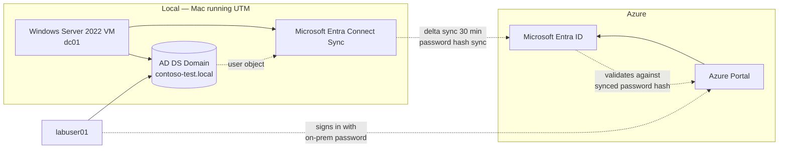

# Module 11 — Hybrid identity deployed

The new module added in v3. **Hybrid identity is deployed end-to-end**, not designed-only as in v2. A Windows Server 2022 VM runs locally on the developer Mac via UTM virtualization. Active Directory Domain Services is installed. A domain `contoso-test.local` is provisioned. **Microsoft Entra Connect Sync** is installed and configured for password hash sync. A synced user signs into the Azure portal with on-premises credentials. A password change on-prem propagates to Microsoft Entra ID within the sync interval.

The deployed-end-to-end version of hybrid identity is a single piece of evidence that strongly differentiates this portfolio from peer applications. Most candidates have only seen Connect Sync diagrams; this candidate has installed it, run it, and watched the sync.

## What this module demonstrates

| Skill | Where it shows up |
|---|---|
| Local virtualization | UTM hypervisor running Windows Server 2022 evaluation |
| AD DS installation | `dcpromo` equivalent via Server Manager, forest creation, domain controller promotion |
| Microsoft Entra Connect Sync | Express settings install, password hash sync, scheduler interval |
| Hybrid user sync | On-prem user appearing in Microsoft Entra ID with `<UPN>@contoso-test.local` source anchor |
| Sign-in with synced credential | Synced user signing into Azure portal with on-prem password |
| Password write-back validation | Password changed on-prem, observed in Entra after sync interval |
| Cloud Sync alternative | Documented as design — when Cloud Sync is preferred over Connect Sync |
| Decommission discipline | Connect Sync uninstall, AD DS demotion, domain teardown |

## Build steps

UTM hypervisor for the Windows Server VM, Server Manager and PowerShell for AD DS, Microsoft Entra Connect Sync installer for sync configuration, Portal for Entra ID verification.

### 1. Install UTM and download Windows Server 2022 evaluation

```bash
# UTM installed in module 00
# Download Windows Server 2022 evaluation ISO
curl -L -o WindowsServer2022.iso "https://software-download.microsoft.com/download/sg/<ISO-URL>"
```

The Windows Server evaluation is free for 180 days — sufficient for the demonstration window. After 180 days, rearm or rebuild.

### 2. Create the VM in UTM

UTM → New VM → Virtualize → Windows. Storage: 60 GB. Memory: 4 GB. Network: shared. Mount the ISO. Boot and install Windows Server 2022 Standard with Desktop Experience.

After installation, configure: hostname `dc01`, static IP within UTM's shared network, time zone, Windows Updates applied.

### 3. Install AD DS and promote to domain controller

Server Manager → Add roles and features → Active Directory Domain Services. Reboot. Server Manager → flag → Promote this server to a domain controller → New forest → Root domain name `contoso-test.local`. Set DSRM password. Default DNS warnings can be acknowledged. Reboot.

After reboot, the server is `dc01.contoso-test.local`, a fresh forest's first domain controller.

### 4. Create test on-premises users and groups

```powershell
# On the domain controller
Import-Module ActiveDirectory

New-ADOrganizationalUnit -Name "Lab" -Path "DC=contoso-test,DC=local"

# Create test users
1..3 | ForEach-Object {
    New-ADUser -Name "labuser0$_" -SamAccountName "labuser0$_" `
        -UserPrincipalName "labuser0$_@contoso-test.local" `
        -Path "OU=Lab,DC=contoso-test,DC=local" `
        -AccountPassword (ConvertTo-SecureString "Lab@P@ssw0rd!" -AsPlainText -Force) `
        -Enabled $true -PasswordNeverExpires $true
}

# Create a security group
New-ADGroup -Name "lab-engineers" -GroupCategory Security -GroupScope Global `
    -Path "OU=Lab,DC=contoso-test,DC=local"
Add-ADGroupMember -Identity "lab-engineers" -Members "labuser01","labuser02"
```

### 5. Add a custom domain to Microsoft Entra ID and verify

In Microsoft Entra → Custom domains → Add custom domain → `contoso-test.local`. Microsoft provides a TXT record for verification. **For a non-routable `.local` domain, this verification will not succeed via DNS** — for the lab, use a routable domain you control, or use the `<tenant>.onmicrosoft.com` UPN that Connect Sync produces from the source anchor.

For evidence purposes, the synced user appears in Entra as `labuser01_contoso-test.local#EXT#@<tenant>.onmicrosoft.com` if the `.local` domain is unverified, or as `labuser01@contoso-test.local` if a routable domain is configured.

### 6. Install Microsoft Entra Connect Sync

On `dc01`, download Microsoft Entra Connect Sync from `https://www.microsoft.com/download/details.aspx?id=47594`.

Run the installer. Choose **Express settings**. The wizard:
1. Prompts for Microsoft Entra Global Administrator credentials
2. Prompts for on-prem AD enterprise admin credentials
3. Configures password hash synchronization
4. Configures the scheduler for delta sync every 30 minutes
5. Performs initial full sync

Capture screenshots throughout: wizard pages, sync configuration summary, completion page.

### 7. Verify sync

```powershell
# Force an immediate delta sync
Start-ADSyncSyncCycle -PolicyType Delta
```

In Microsoft Entra → Users → All users → filter to "Sync from Active Directory" → confirm `labuser01`, `labuser02`, `labuser03` appear with **Source: Windows Server Active Directory**.

### 8. Sign in as the synced user

In a private browser, navigate to `https://portal.azure.com`. Enter `labuser01@<tenant>.onmicrosoft.com` (or `labuser01@contoso-test.local` if domain verified) and the on-prem password `Lab@P@ssw0rd!`.

The user signs in successfully. The sign-in log shows the authentication source. Capture both the successful sign-in and the sign-in log entry.

### 9. Password change validation

On `dc01`, change `labuser01`'s password:

```powershell
Set-ADAccountPassword -Identity "labuser01" -Reset `
    -NewPassword (ConvertTo-SecureString "NewLab@P@ssw0rd!" -AsPlainText -Force)
Start-ADSyncSyncCycle -PolicyType Delta
```

Wait 5 minutes. Sign in to Azure portal with the new password. Capture the successful sign-in proving password hash propagated.

### 10. Connect Sync scheduler and connectors

Sync → Operations → review the sync history. Connectors → review on-prem AD connector and Microsoft Entra connector configuration. Capture both.

### 11. Microsoft Entra Cloud Sync alternative — DESIGN

`docs/cloud-sync-alternative.md` documents Microsoft Entra Cloud Sync as the lighter-weight alternative to Connect Sync. Cloud Sync uses agents (no full Windows Server installation), supports multi-forest more easily, but does not support all Connect Sync features (no device write-back, no Exchange hybrid, no group write-back). The decision rule: Connect Sync for full feature breadth and existing Exchange hybrid; Cloud Sync for greenfield or simpler topologies.

### 12. Optional: Microsoft Entra Connect Health

Connect Health monitors Connect Sync and AD FS health from the cloud. Documented in `docs/connect-health-design.md`. Requires Microsoft Entra ID P1.

### 13. Decommission

When the demonstration is complete:

```powershell
# On dc01 — uninstall Connect Sync first
# Control Panel → Programs → Microsoft Entra Connect → Uninstall

# Then demote the domain controller
Uninstall-ADDSDomainController -DemoteOperationMasterRole -RemoveApplicationPartitions

# Then uninstall the AD DS role
Uninstall-WindowsFeature AD-Domain-Services -IncludeManagementTools

# Shut down the UTM VM
```

In Microsoft Entra → Users → filter Source = Windows Server Active Directory → confirm synced users now show Source = Microsoft Entra ID (orphaned cloud objects after sync removal). Delete orphaned synced users in the portal if desired.

## Validation

- AD DS installed; `dc01.contoso-test.local` is a working domain controller.
- Three lab users in `OU=Lab` visible in Active Directory Users and Computers.
- Microsoft Entra Connect Sync installer completes Express settings successfully.
- `Start-ADSyncSyncCycle -PolicyType Delta` completes without errors.
- All three on-prem users appear in Microsoft Entra → Users with Source = Windows Server Active Directory.
- `labuser01` signs into Azure portal with on-prem password.
- Password change on-prem propagates to Entra; new password works in portal after sync interval.
- Sync history shows successful delta sync runs every 30 minutes.

## Cleanup

The Windows Server VM runs locally on the Mac and costs nothing in Azure. The Connect Sync configuration leaves cloud objects in Microsoft Entra; uninstall Connect Sync first, then optionally delete the orphaned synced users in the portal.

The `rg-hybrid-lab-eastus-01` resource group in Azure is empty for this module — all resources live on the local Mac.

**Cost:** $0 spent in Azure. UTM and Windows Server evaluation are free.

## Evidence

| File | Demonstrates |
|---|---|
| `screenshots/11-utm-vm-running.png` | Windows Server 2022 VM running in UTM |
| `screenshots/11-windows-server-installed.png` | Windows Server desktop |
| `screenshots/11-server-manager-roles.png` | AD DS role added in Server Manager |
| `screenshots/11-ad-ds-promoted.png` | Domain controller promotion completed |
| `screenshots/11-domain-contoso-test.png` | `contoso-test.local` domain in AD Users and Computers |
| `screenshots/11-lab-users-in-ad.png` | Three lab users in OU=Lab |
| `screenshots/11-lab-engineers-group.png` | lab-engineers security group with members |
| `screenshots/11-entra-connect-sync-wizard.png` | Connect Sync Express settings wizard |
| `screenshots/11-entra-connect-sync-installed.png` | Sync configuration summary |
| `screenshots/11-sync-history.png` | Sync history showing delta sync runs |
| `screenshots/11-sync-user-in-entra.png` | Synced user in Microsoft Entra ID |
| `screenshots/11-synced-user-signin.png` | Synced user signing into Azure portal |
| `screenshots/11-signin-log-on-prem-source.png` | Sign-in log entry showing on-prem source |
| `screenshots/11-password-change-onprem.png` | Password change command on dc01 |
| `screenshots/11-password-hash-sync-verified.png` | New password working in Azure portal |
| `scripts/setup-ad-ds.ps1` | AD DS installation and forest creation |
| `scripts/create-lab-users.ps1` | Lab user and group creation |
| `diagrams/11-hybrid-identity-topology.mmd` | Local DC + Connect Sync + Entra |
| `diagrams/11-sync-flow.mmd` | Password hash flow from on-prem to cloud |
| `docs/cloud-sync-alternative.md` | Cloud Sync vs Connect Sync decision |
| `docs/connect-health-design.md` | Connect Health monitoring design |
| `docs/decisions/ADR-0018-connect-sync-vs-cloud-sync.md` | Decision: Connect Sync for full feature breadth |

### Mermaid embedded — hybrid identity topology



## Resume bullets

- Deployed Microsoft Entra Connect Sync end-to-end against a locally hosted Windows Server 2022 domain controller running in UTM virtualization, configured password hash synchronization with 30-minute delta sync intervals, and validated end-user sign-in to Azure with on-premises credentials.
- Provisioned an Active Directory Domain Services forest from scratch, including domain controller promotion, organizational unit structure, and lab user and group creation, replicating the on-premises identity infrastructure pattern most enterprises operate.
- Validated password hash propagation by changing a user password on-premises and confirming the change took effect in Microsoft Entra ID after the sync interval — the canonical proof that hybrid identity sync works end-to-end.
- Documented the decision between Microsoft Entra Connect Sync and Microsoft Entra Cloud Sync as Architecture Decision Record 0018, with a feature comparison matrix and selection rules.
- Captured the Microsoft Entra Connect Sync wizard, sync history, connector configurations, and end-user sign-in log evidence — distinguishing this portfolio from peer applications that document hybrid identity at design level only.
- Designed the decommission workflow for Connect Sync: uninstall sync, demote domain controller, uninstall AD DS role, in correct dependency order to avoid orphaned cloud objects.
- Migrated all hybrid-identity terminology to current Microsoft naming — Microsoft Entra ID and Microsoft Entra Connect Sync — replacing legacy "Azure AD" and "DirSync" / "Azure AD Connect" terms across all documentation.

## Interview stories

### Beginner — "What is hybrid identity?"

Most enterprises run Active Directory on-premises. They also run cloud workloads requiring Microsoft Entra ID identities. Hybrid identity is the synchronization layer between them — Microsoft Entra Connect Sync replicates user accounts, groups, and password hashes from on-premises AD into Entra so users can sign into cloud workloads with their existing on-prem credentials. The capture proof in this module is a synced user signing into the Azure portal with the password that was set on the on-prem domain controller.

### Intermediate — "Connect Sync versus Cloud Sync?"

Connect Sync is the full-featured product. It runs as a Windows service on a server you maintain. It supports password hash sync, pass-through authentication, federation, device write-back, group write-back, Exchange hybrid scenarios. Cloud Sync is the lighter alternative. It runs as agents on any Windows Server, supports multi-forest more easily, but doesn't have device write-back, Exchange hybrid, or group write-back. The decision rule: Connect Sync if you have Exchange hybrid or need full feature breadth; Cloud Sync if you're greenfield or have a simple multi-forest topology. ADR-0018 captures the decision in this lab.

### Architecture — "How do you reason about identity unification across cloud and on-prem?"

Three identity-source patterns. Cloud-only: identities exist in Microsoft Entra ID only; no on-prem AD. Synced (this module): on-prem AD is the source of truth; Connect Sync replicates to Entra; password hash sync allows cloud sign-in with on-prem credentials. Federated: on-prem AD FS or third-party IDP issues tokens for cloud sign-in; Entra trusts the federation. Each has different operational characteristics. Cloud-only is simplest but assumes no on-prem identity legacy. Synced is the modern default — most enterprises use this. Federated is fading; AD FS deprecation pressure is real. The portfolio demonstrates the synced pattern because it's what most enterprises actually run, and the deployed evidence — installer wizard, sync history, password propagation — proves operational competence rather than just textbook knowledge. The architectural lesson: identity infrastructure choices have multi-year operational cost; choose for the pattern you'll still want to support in five years.

## Five-minute video script

See `videos/11-script.md`. Hook: *"In this video I'll install a domain controller on my laptop, install Microsoft Entra Connect Sync, sync a user from my local AD into Microsoft Entra ID, and sign into the Azure portal with on-premises credentials — proving hybrid identity end-to-end."*
