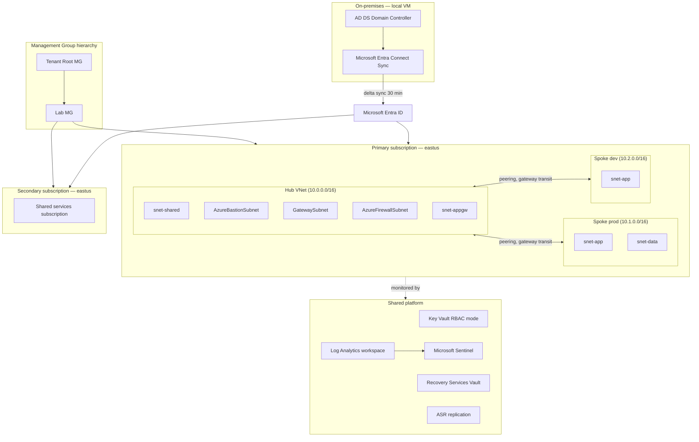

# Secure Azure Operations Portfolio

A hands-on, production-style Azure environment built and operated by a single engineer to demonstrate cloud operations, identity, networking, monitoring, backup, security, and infrastructure-as-code skills. Twelve modules cover the Azure administration surface from foundational governance through hybrid identity deployment, with every high-cost service (Azure Firewall, Application Gateway WAF v2, VPN Gateway, Front Door, Microsoft Sentinel, full Azure Site Recovery replication) deployed briefly with captured evidence rather than left as design diagrams.

The deployed environment is named the **Secure Azure Administration Environment** — a multi-subscription hub-and-spoke topology with management group inheritance, an on-premises Active Directory synchronizing to Microsoft Entra ID, centralized monitoring through a Log Analytics workspace, and infrastructure managed as code via Bicep deployed through GitHub Actions OIDC federated credentials.

## Why this exists

Most cloud portfolios show toy labs in isolation: one VM here, one storage account there, no story. This portfolio is structured the way a small platform team would actually run an Azure subscription — multi-subscription governance, tagged resources, role-based access, monitored workloads, automated deployments, hybrid identity sync, a Sentinel detection layer, and a tested recovery path including full-site failover. Each of the twelve modules is independently runnable but designed to plug into the others. Every claim is backed by deployable code or a screenshot proving the configuration was real.

## Architecture



## Module index

| # | Module | Focus |
|---|---|---|
| 00 | Project overview | Repo, tooling, naming, tagging baseline |
| 01 | Governance and cost | Management groups deployed, multi-subscription policy inheritance, custom policies, locks, budgets |
| 02 | Identity and RBAC | Users, groups, custom roles, Administrative Units, Conditional Access including report-only mode |
| 03 | Networking | Hub-and-spoke, NSGs/ASGs, service tags, DNS, Internal LB, Application Gateway WAF v2, Azure Firewall, VPN Gateway, Front Door, Network Watcher |
| 04 | Compute | VMs, Availability Sets, Availability Zones, scale sets, disks, images, extensions, Bastion Standard SKU |
| 05 | Storage | Hardened accounts, private endpoints, lifecycle, immutability, Azure Files with Microsoft Entra Kerberos |
| 06 | Monitoring and logs | Log Analytics, Azure Monitor Agent + Data Collection Rules, KQL, alerts, action groups, Microsoft Sentinel enabled |
| 07 | Backup and recovery | Recovery Services Vault, file and full-VM restore drill, Azure Site Recovery deployed with failover |
| 08 | Security operations | Key Vault RBAC mode, Managed Identity, Defender for Cloud all major plans enabled briefly, JIT, secure score before/after |
| 09 | IaC and automation | Bicep modules, GitHub Actions OIDC federated credentials, Automation Account runbooks |
| 10 | Final capstone | Eight troubleshooting drills, end-to-end redeployment, integration validation |
| 11 | Hybrid identity deployed | Local Windows Server VM, AD DS installed, Microsoft Entra Connect Sync running, synced user signing into Azure |

Each module folder contains its own `README.md` with explanation, build steps, exact screenshot filenames, validation checks, cleanup commands, resume bullets, three interview stories at different seniority levels, and a five-minute video walkthrough script. Start with [`00-project-overview/README.md`](./00-project-overview/README.md).

## Naming and tagging

```
<type>-<workload>-<env>-<region>-<instance>

rg-network-hub-lab-eastus-01
vnet-hub-lab-eastus-01
vm-app-lab-eus-01
kv-portfolio-lab-eus-01
fw-hub-lab-eastus-01
agw-app-lab-eastus-01
```

Five required tags on every resource: `Environment`, `Module`, `Owner`, `CostCenter`, `ExpiryDate`. Untagged resources are flagged daily by an Automation runbook and remediated via a tag-inheritance Modify policy. The full standard is in [`architecture.md`](./architecture.md).

## Cost discipline

Total project budget: $300 across roughly 60 days. Sustained baseline runs $15–25/month. High-cost services (Azure Firewall ~$1.25/hr, Application Gateway v2, VPN Gateway, Front Door, Sentinel, full ASR replication, all Defender plans) are deployed briefly, validated with screenshots, and torn down inside the same session via an automated kill-switch script that runs at the end of every build session. Daily orphan-resource audits catch unattached disks, idle public IPs, and stranded NICs. Full strategy in [`cost-and-cleanup.md`](./cost-and-cleanup.md).

## Decisions

Architecture decisions are recorded as ADRs in [`docs/decisions/`](./docs/decisions/). Twenty-two decisions are recorded covering hub-and-spoke topology, multi-subscription management group hierarchy, RBAC permission mode for Key Vault, OIDC federated credentials over service principal secrets, customer-managed encryption keys, soft-delete trade-offs, hybrid identity model selection (Connect Sync vs Cloud Sync), Defender plan enablement strategy, Sentinel scope, ASR redundancy choices, and others.

## Video walkthrough series

Each module includes a five-minute video script outline in `videos/<module>-script.md`. The optional walkthrough series demonstrates each module live in the Azure portal — useful for LinkedIn posts, YouTube uploads, or cover-letter video links. Scripts are structured: 30-second hook, three 90-second demo segments, 30-second takeaway. See [`videos/walkthrough-guide.md`](./videos/walkthrough-guide.md) for filming guidance.

## How to use this repo

This is reference material, not a deployable end-to-end product. Each module is self-contained — you can run module 03 (networking) without running module 07 (backup). All scripts are parameterized; no subscription IDs, tenant IDs, or personal identifiers are committed. Replace the `<>` placeholders in any command with your own values.

## License

MIT — see [`LICENSE`](./LICENSE).
