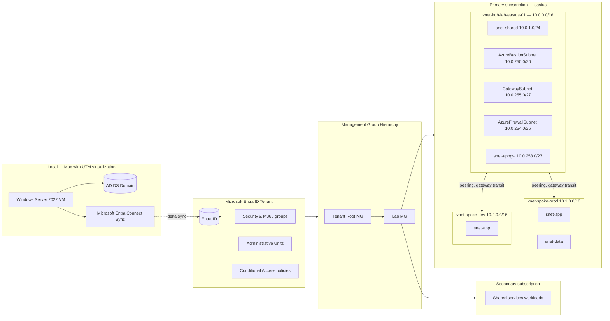

# Architecture

This document describes the topology, naming standard, tagging policy, and high-level design choices for the **Secure Azure Administration Environment** deployed in this portfolio.

## Topology — multi-subscription, hub-and-spoke, hybrid identity

A hub-and-spoke network design across two Azure subscriptions joined under a management group hierarchy, with on-premises Active Directory synchronized to Microsoft Entra ID via Microsoft Entra Connect Sync running on a local Windows Server VM.



Spoke-to-spoke traffic transits the hub through Azure Firewall (deployed briefly during the demonstration). Without the Firewall, peering is non-transitive — spokes can reach the hub directly but not each other.

## Multi-subscription model

Two subscriptions joined under a `Lab MG` management group:

| Subscription | Purpose | Resources |
|---|---|---|
| Primary | Workload subscription | All compute, storage, networking, monitoring, security |
| Secondary | Shared services subscription | Cross-sub role assignments, shared Log Analytics workspace from primary, cross-sub policy inheritance demonstration |

Policies assigned at `Lab MG` scope inherit to both subscriptions. Role assignments at MG scope apply across subscriptions, enabling the User Access Administrator-at-MG pattern for cross-subscription delegation.

## Address space

| VNet | Range | Purpose |
|---|---|---|
| `vnet-hub-lab-eastus-01` | 10.0.0.0/16 | Hub: shared services, Bastion, Gateway, Firewall, AppGW |
| `vnet-spoke-prod-lab-eastus-01` | 10.1.0.0/16 | Production workload spoke |
| `vnet-spoke-dev-lab-eastus-01` | 10.2.0.0/16 | Dev/test spoke |

The hub VNet has five reserved subnets (`AzureBastionSubnet`, `GatewaySubnet`, `AzureFirewallSubnet`, `snet-shared`, `snet-appgw`). Reserved subnet names are recognized by the platform and treated specially.

## Resource groups

Resource groups slice by service domain. Environment is expressed via the `Environment` tag.

| Resource group | Contains |
|---|---|
| `rg-network-hub-lab-eastus-01` | All VNets, peerings, NSGs, Bastion, Firewall, App Gateway, VPN GW, Front Door |
| `rg-platform-lab-eastus-01` | Log Analytics workspace, Sentinel workspace solution, Automation Account |
| `rg-identity-lab-eastus-01` | Identity assets (test users, groups, custom roles managed at MG scope) |
| `rg-compute-lab-eastus-01` | VMs and VMSS |
| `rg-storage-lab-eastus-01` | Storage accounts |
| `rg-monitor-lab-eastus-01` | Diagnostic settings, alerts, action groups |
| `rg-backup-lab-eastus-01` | Recovery Services Vault, ASR replication |
| `rg-security-lab-eastus-01` | Key Vault, Defender configurations |
| `rg-iac-lab-eastus-01` | Sandbox for Bicep deployments |
| `rg-hybrid-lab-eastus-01` | Hybrid identity sync target users |

## Naming standard

```
<type>-<workload>-<env>-<region>-<instance>
```

| Type prefix | Resource |
|---|---|
| `rg` | Resource group |
| `vnet` | Virtual network |
| `snet` | Subnet (positional in commands; not always part of name) |
| `nsg` | Network security group |
| `asg` | Application security group |
| `vm` | Virtual machine |
| `vmss` | Virtual machine scale set |
| `kv` | Key Vault |
| `st` | Storage account |
| `law` | Log Analytics workspace |
| `rsv` | Recovery Services Vault |
| `lb` | Load balancer |
| `pip` | Public IP |
| `nic` | Network interface |
| `disk` | Managed disk |
| `aa` | Automation Account |
| `fw` | Azure Firewall |
| `agw` | Application Gateway |
| `vng` | VPN Network Gateway |
| `fd` | Front Door |
| `mi` | Managed Identity (user-assigned) |

Storage accounts and Key Vaults have global name uniqueness; append a 4-character suffix when needed.

## Tagging policy

Five tags required on every billable resource, enforced by Azure Policy at `Lab MG` scope (inherits to both subscriptions).

| Tag | Required | Example |
|---|---|---|
| `Environment` | Yes | `lab` |
| `Module` | Yes | `03-networking` |
| `Owner` | Yes | `<your-handle>` |
| `CostCenter` | Yes | `portfolio` |
| `ExpiryDate` | Yes | `2026-08-31` |

`ExpiryDate` is consumed by an Automation runbook in module 09 that flags resources past their expiry.

## Identity layer

Microsoft Entra ID provides the directory. The naming throughout this portfolio uses **Microsoft Entra ID** rather than the legacy "Azure AD" term. Cmdlets are Microsoft Graph PowerShell (`Connect-MgGraph`, `New-MgInvitation`, `New-MgUser`); the deprecated `AzureAD` and `MSOnline` modules are not used.

**Hybrid identity is deployed end-to-end.** A Windows Server 2022 VM runs locally on the developer Mac via UTM virtualization. AD DS is installed; a domain `contoso-test.local` is provisioned. Microsoft Entra Connect Sync is installed and configured for password hash sync. A synced user (`labuser01@contoso-test.local`) signs into the Azure portal as `labuser01@<tenant>.onmicrosoft.com`.

Conditional Access enforces MFA from untrusted locations. **Report-only mode** is demonstrated explicitly — a policy is created in report-only state, sign-ins evaluated against it without enforcement, sign-in logs reviewed for what would have been blocked, then the policy is moved to On.

## Monitoring layer

A single centralized Log Analytics workspace (`law-portfolio-lab-eastus-01`) collects diagnostics from every module. **Azure Monitor Agent** (AMA) and **Data Collection Rules** (DCRs) are the modern path; the deprecated Log Analytics agent (MMA/OMS) is not used. A 0.5 GB/day ingestion cap protects the budget.

**Microsoft Sentinel is enabled** on the workspace with one data connector (Azure Activity) and one analytics rule (sign-in from impossible-travel locations). Sentinel is enabled briefly, evidence captured, then disabled to control cost — Sentinel adds approximately $2.30/GB on top of standard ingestion.

## Security layer

Key Vault in **RBAC permission mode** (`kv-portfolio-lab-eus-XX`) holds secrets, certificates, and keys. VMs use system-assigned Managed Identity to fetch secrets without storing credentials. **Defender for Cloud all major plans** are enabled briefly during the demonstration: Defender for Servers Plan 2, Defender for Storage, Defender for Key Vault, Defender for Resource Manager, Defender for SQL. After secure-score and JIT evidence is captured, all paid plans are reverted to the foundational tier.

## What is deployed vs design-only

The v3 portfolio deploys nearly everything; design-only is reserved for items that are out of scope for the Azure administrator role surface or where deployment cost cannot be bounded.

**Deployed continuously (sustained $15–25/month):** Log Analytics workspace, one storage account, Key Vault, all VNets/subnets/NSGs/peerings/ASGs, tagged empty resource groups, Automation Account, action groups, basic alerts, MG hierarchy, second subscription onboarded, custom RBAC roles.

**Deployed briefly then torn down (within-session cost ~$5–50):** Bastion Standard SKU, Internal Load Balancer with backend VMs, Application Gateway WAF v2, Azure Firewall Standard, VPN Gateway Basic, Front Door Standard, Recovery Services Vault with one VM backed up, full ASR replication for one VM with failover/failback drill, Defender for Servers/Storage/KV/SQL/Resource Manager Plan 2 enabled briefly, Sentinel enabled briefly with one connector and one analytics rule, customer-managed key for storage encryption.

**Design-only (still not deployed in v3):** ExpressRoute (requires partner circuit), Azure Arc (out of scope at deployment depth for the Azure administrator role surface), Azure Lighthouse (multi-tenant; out of scope), Azure Container Apps and AKS (out of scope; covered by application-platform certifications).

## Decision summary

22 ADRs in [`docs/decisions/`](./docs/decisions/) document every consequential design choice.

| ADR | Decision |
|---|---|
| 0001 | Hub-and-spoke topology over flat single-VNet |
| 0002 | Tags for environment, resource groups for service domain |
| 0003 | Management group hierarchy deployed (not designed) |
| 0004 | Custom policy denying VM SKUs above DS2_v2 |
| 0005 | User Access Administrator scoped narrowly over Owner for delegation |
| 0006 | Hub-and-spoke detailed cost and complexity tradeoff |
| 0007 | Availability Zones for new workloads, AvSet for legacy continuity |
| 0008 | Disable shared key access on storage accounts |
| 0009 | Centralized Log Analytics workspace vs per-team workspaces |
| 0010 | Disable soft-delete on RSV for lab cycle time |
| 0011 | Key Vault RBAC permission mode over access policies |
| 0012 | System vs user-assigned Managed Identity selection rules |
| 0013 | Customer-managed keys for storage encryption |
| 0014 | Bicep over ARM JSON |
| 0015 | OIDC federated credentials over service principal secrets |
| 0016 | Azure Firewall in hub vs per-spoke NVAs |
| 0017 | Application Gateway WAF v2 vs Front Door for L7 protection |
| 0018 | Microsoft Entra Connect Sync vs Cloud Sync selection rules |
| 0019 | Defender for Cloud plan enablement strategy and cost discipline |
| 0020 | Sentinel scope — enable briefly for evidence vs sustained ops |
| 0021 | ASR storage redundancy in lab vs production |
| 0022 | Conditional Access report-only mode as deployment safety pattern |
